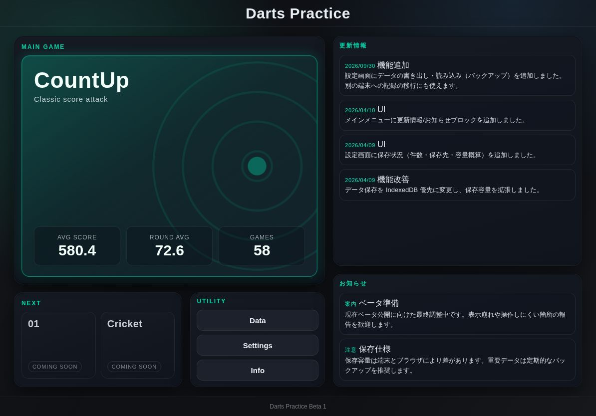
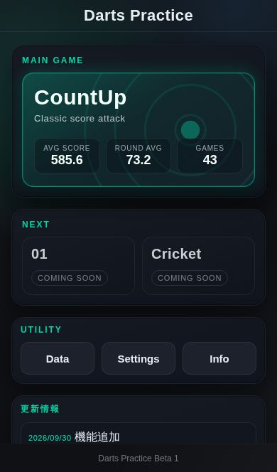
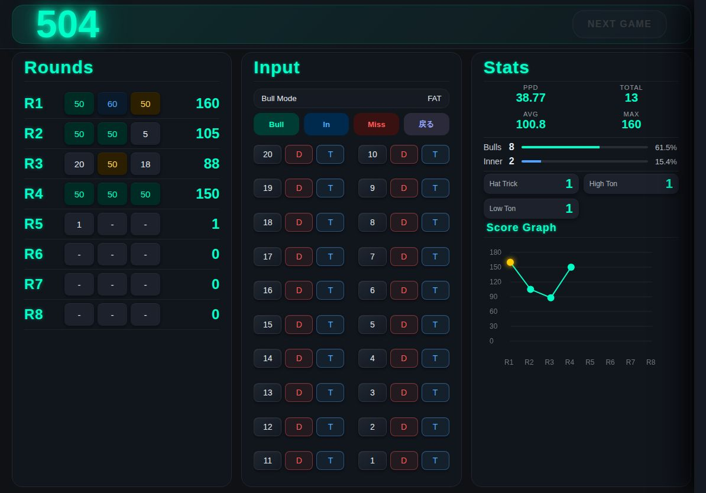
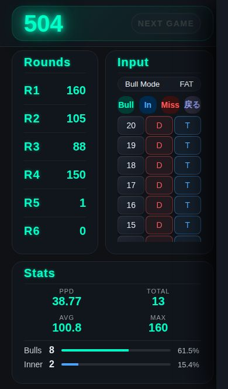
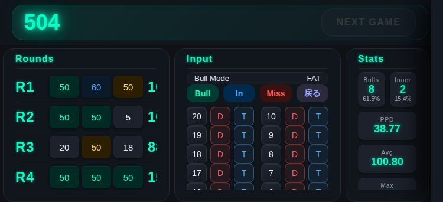
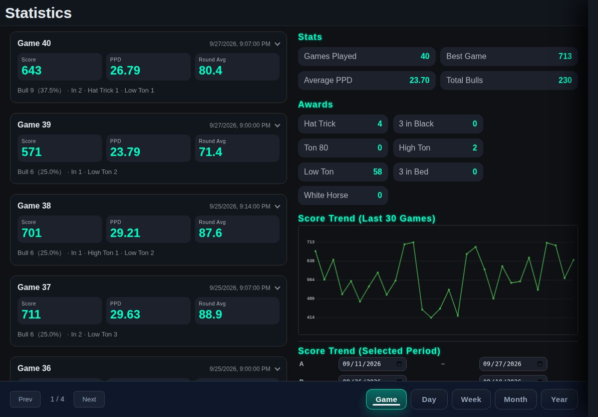
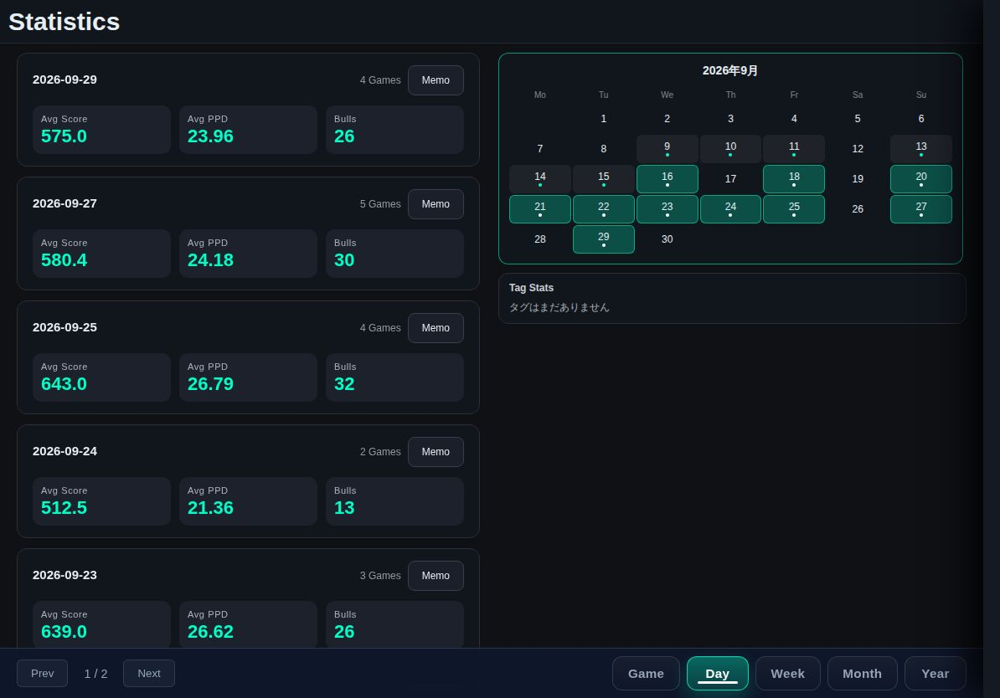
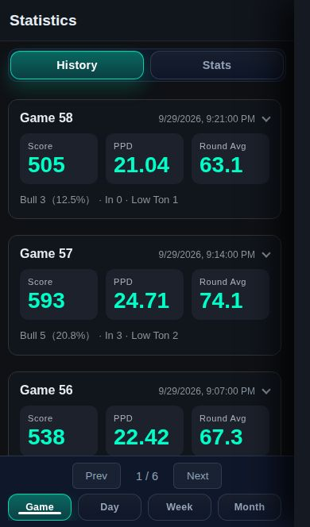
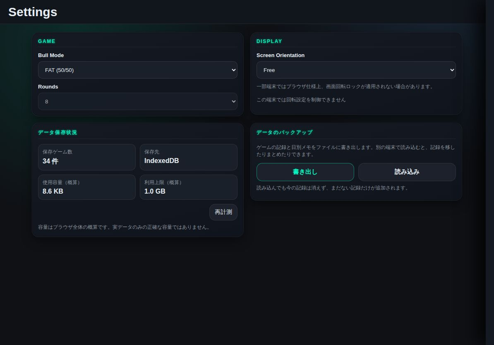
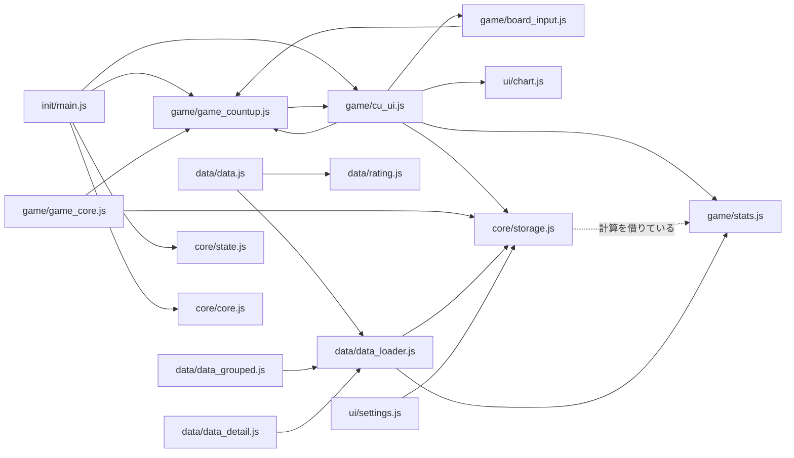

# ダーツアプリ設計書

| 項目 | 内容 |
| --- | --- |
| 作成者 | マチル |
| 初版 | 2026.3.23（LaTeX 版） |
| 最終更新 | 2026.9.30（現行コードに合わせて全面改訂・Markdown 化） |

## 目次

1. [はじめに](#1-はじめに)
2. [目的](#2-目的)
3. [開発環境](#3-開発環境)
4. [画面構成](#4-画面構成)
5. [ディレクトリ構成](#5-ディレクトリ構成)
6. [データ設計](#6-データ設計)
7. [データフロー](#7-データフロー)
8. [モジュール責務定義](#8-モジュール責務定義)
9. [PWA（オフライン対応）](#9-pwaオフライン対応)
10. [現状の課題](#10-現状の課題)
11. [今後の拡張予定](#11-今後の拡張予定)
12. [更新履歴](#12-更新履歴)

---

## 1. はじめに

この文書は、ダーツアプリ開発プロジェクトの設計書である。個人開発のプロジェクトではあるが、各ファイルの責務などを改めて確認するために、簡易的に設計書としてまとめる。

主に JavaScript の責務や関数、CSS の責務などがわからなくならないようにするための資料である。コードを変更した際は、本書も合わせて更新する。

## 2. 目的

本アプリは、ダーツ技術の向上のために、ダーツを家で投げる際の練習を補助し、データを分析することを目的とする。DARTSLIVE などの対戦中心のアプリではなく、練習分析に特化したツールとする。最終的にはアプリケーションとして一般公開を視野に開発する。

現在は、メイン画面・カウントアップ画面・データ表示画面・設定画面・お知らせ画面の 5 画面で構成されている。ゲームの種類はカウントアップのみであるが、今後 01・クリケットをはじめ、ハーフイット・シュートアウトなどのゲームも実装を予定している。

基本的には iPad Pro 11inch の横画面表示での使用を想定しているが、一般公開した場合はスマートフォンで使用するユーザーが多いと考えられる。そのため、各端末での動作テストも行いながら開発する。

## 3. 開発環境

GitHub 上のリポジトリ（`izayoisinya/darts-practice`）を iPad 及びタブレット端末から編集する形式で開発を行う。

| 時期 | 環境 |
| --- | --- |
| 初期 | ChatGPT |
| 〜2026.3 | GitHub Copilot（Web）＋ Spck Editor |
| 〜2026.9 | VS Code ＋ GitHub Copilot |
| 2026.9〜 | Claude Code（Web）。作業ブランチ → PR → `main` へマージ |

- 言語：HTML / CSS / JavaScript（フレームワーク・ビルドツールなし）
- 動作確認：静的サーバー（例：`python3 -m http.server 8000`）で配信してブラウザで開く

### 3.1 端末

**開発及びテストに用いる端末**

| 端末 | 用途 |
| --- | --- |
| iPad Pro 11inch（第 2 世代） | メインの開発端末 |
| iPad Air 11inch（M2 チップ） | 資料の表示、アプリのテスト |
| REDMAGIC Astra | 主にテスト。場合によっては編集作業も行う |

**テストに用いる端末**

| 端末 | 備考 |
| --- | --- |
| Nothing Phone (3) | メインのテスト端末 |
| AQUOS sense 9 | |
| OPPO Reno 11A | |
| Redmi 12 5G | |
| iPhone XR | |
| iPhone 7 | 古い iOS Safari。新しすぎる JS/CSS 機能を避ける目安 |

大枠ができたらメインのテスト端末以外でも確認する。

## 4. 画面構成

画面は以下の 5 つの HTML で構成される。画面の画像は `docs/images/` にあり、サンプルデータを入れた状態で撮影したものである。

| ファイル | 画面 |
| --- | --- |
| `index.html` | メイン画面（メニュー） |
| `countup.html` | カウントアップ画面 |
| `data.html` | データ表示画面（Statistics） |
| `settings.html` | 設定画面 |
| `news.html` | お知らせ画面 |

メイン画面以外では、画面右端の細い帯（幅 10px）をタップするか、画面の右端から 48px 以内（Android は OS の「戻る」ジェスチャーが端を使うため 96px 以内）で触れて左へスワイプするとサイドメニューが右から横にすべって出てきて、各画面へ遷移できる。メニューを右へスワイプするか、外側をタップすると閉じる。スワイプ中はメニューが指に合わせて動き、離したときに半分以上（または素早く）動かしていれば開閉する（`main.js` の `setupSideMenu()` / `setSideMenuOpen()`、`lay_menu.css`）。メニューの中身は、ステータスバー・ホームバー・横向きの丸い角に重ならないよう安全領域の分だけ内側に寄せる。スワイプは document 全体で受けるので、ボードなどの上から始めても開ける。データ画面の History / Stats の切り替えスワイプは、この範囲から始めたときは行わない（`isSideMenuSwipeStart()` / `getSideMenuSwipeZone()`）。

**画面の左右の余白**：ゲーム・データ・設定・お知らせの各画面のヘッダーと中身の左右の余白は、`base.css` の `--gutter-left` / `--gutter-right`（`--gutter`：スマホ 12px、それ以外 20px に、その側の安全領域を足したもの）で左右同じにそろえる。以前はサイドメニューの帯の分だけ右を広く空けていたが、帯を余白より細くしたので不要になった。

**ブラウザの「端からスワイプして戻る・進む」を止める**：画面の左右の端（10px 以内。画面の余白より狭くして、端のボタンのタップを止めないようにする）から触れたときは、そのタッチの既定の動きを止める（`main.js` の `setupEdgeSwipeGuard()`。iPhone / iPad の Safari 向け）。横スクロールでの戻る・進む（Chrome / Android など）は `base.css` の `overscroll-behavior-x: none` で止める。端のタップではクリックが出なくなるので、右端の帯のタップと、外側の幕の端のタップはスワイプの処理の中で開閉する。サイドメニューの「Reset Game」（`forceResetGame()`：進行中のゲームだけをリセット。保存済みの記録は消さない）はカウントアップ画面にだけ置く。

### 4.1 index.html（メイン画面）



アプリを起動してすぐの画面。以下のブロックで構成される。

| ブロック | 内容 |
| --- | --- |
| MAIN GAME | カウントアップ。平均スコア・平均ラウンドスコア・ゲーム数のサマリーを表示 |
| NEXT | 01・Cricket（Coming Soon で押せない） |
| UTILITY | Data・Settings・Info への遷移ボタン |
| 更新情報 / お知らせ | `news.js` の `INFO_CONTENT` の内容を表示 |

レイアウト（`menu.css`）：ページの高さは画面に固定し、ヘッダーとフッターの間をスクロール領域にする。中身は左列（MAIN GAME、その下に NEXT と UTILITY）と右列（更新情報、お知らせ）の 2 列。

| 端末 | 並び |
| --- | --- |
| タブレット横・PC | 左右 2 列を画面の高さいっぱいに伸ばし、余った高さは CountUp と更新情報が使う（更新情報が多い分は欄の中でスクロール） |
| タブレット縦 | 上に CountUp、その下に NEXT と UTILITY を横並び、残りの高さに更新情報とお知らせを左右に並べる |
| スマホ縦 | 縦に順番に並べ、ページをスクロール |
| スマホ横 | 左右 2 列で、ページをスクロール |



### 4.2 countup.html（カウントアップ画面）



カウントアップの画面は、上部のヘッダーと Rounds・Input・Stats の 3 つのエリアで構成される。

| エリア | 内容 |
| --- | --- |
| ヘッダー | 合計スコア、ヘッダーの真ん中に今のラウンド（R1〜R8）の各ダーツの得点（合計スコアと同じ光る数字。色はトリプル＝青・ダブル＝赤・インブル＝金・それ以外は緑、ミスと未入力は薄く。3 投目のあとは次の 1 投目まで入れ終わったラウンド。幅 360px 未満のスマホ縦では出さない。入れた数字をタップするとその 1 投を消し、後ろの投を前に詰める。確定済みのラウンドは消せない）、NEXT GAME ボタン（8 ラウンド終了で押せる） |
| Rounds | 各ラウンド（R1〜R8）の 1 投ごとの得点とラウンド合計 |
| Input | ブルモード表示、Bull / In（インナーブル）/ Miss / 戻る、1〜20 と D（ダブル）・T（トリプル）の入力ボタン。設定で Board にすると、入力ボタンの代わりにダーツボードを表示する（下記）。横向きでボードの左右に幅 120px 以上の空きがあるとき（Rounds / Stats を隠したときなど）は、ボードの横に 4 つのパネルを出す。左上は Awards（このゲームで取ったアワードの数。取ったものは光らせ、取っていないものは薄く。ヒートマップの上に収まるときだけ）、右上はラウンドスコアのグラフ（「Round Score」。終わったラウンドを光る線で結び、最高は金色、途中のラウンドは輪で今の合計）、右下は Stats（PPD・AVG・MAX・DARTS・BULL・IN-BULL）、左下はこのゲームのヒートマップ（「This Game」と投数。レーダー風の画面に、ボード入力で入れた投の位置を光る点で出す。古い投ほど薄く、今のラウンドの投は白く光る点と輪。走査線が 4 秒で 1 周する）を出す |
| Stats | PPD・投げた本数・平均ラウンドスコア・最高ラウンドスコア、ブル数とブル率、インナーブル数と率、獲得アワード、ラウンドスコアのグラフ |

**画面の縦方向の割り付け**

`body.page-countup` を縦並びの flex にし、ヘッダーは中身の高さ（上下 8px の余白）、カラム（`.container`）は残りの高さを全部使う。安全領域（ステータスバー・ホームバー）の余白は、上はヘッダーの padding、下は `body` の padding でそれぞれ 1 回だけ取る。これにより、端末・向き・ホーム画面からの起動かどうかに関係なく、ヘッダーとカラムの間隔が一定（約 14px）になり、カラムの下端も画面内に収まる（`lay_core.css`）。

**スマートフォン縦向き**



Rounds エリアと Input エリアが横並びになり、その下に Stats エリアが表示される。Rounds エリアをタップするとエリアが開き、各ダーツのスコアが表示される（`body.round-open`）。Input エリアは消さずに幅 0 まで畳む。

**スマートフォン横向き**



各エリアが全て横並びになり、Stats エリアがコンパクト表示になる。コンパクト Stats エリアをタップすると Stats エリアが開き、詳細情報が表示される（`body.iphone-stats-open`）。

**ボード形式の入力**

設定画面の Input Style を Board にすると、1〜20 と D / T のボタンの代わりにダーツボード（SVG）を表示し、刺さった場所をタップして入力する（`board_input.js`）。ボードで入れられる Bull・In（ブル）と Miss のボタン、Bull Mode の表示は隠す。戻るボタンは設定画面の Board Undo Button で出したときだけ表示する（初期値は隠す。`main.js` が `body.hide-undo-button` を付ける。`lay_input.css`）。

- タップした位置から点数・S/D/T・ブルを求め、ボタン形式と同じ `addDart()` に渡す（点数計算・アワード判定・保存は共通）。ダブルの外（数字の輪や四隅）は Miss。アウターブルは Bull ボタンと同じくブルモードに従う（FAT 50 / SEPARATE 25）
- 指で押せるよう、ブル・トリプル・ダブルの輪は本物の比率より太く描く（ダブルの外側を 1 として、インブル 0〜0.08、アウターブル〜0.17、内側シングル〜0.52、トリプル〜0.63、外側シングル〜0.89、ダブル〜1。トリプルとダブルは同じ太さ 0.11）
- ボードは入力エリアの縦横の短い方に合わせ、左右は中央・上下は上詰めで描く（`preserveAspectRatio="xMidYMin meet"`。タップ位置の計算もこれに合わせる）
- 今のラウンドのタップ位置に何投目かの番号付きの印を付ける（3 投目のあとは次の 1 投目まで直前のラウンドを表示）。直前の 1 投（例 `T20  60`）を左上に少しのあいだ表示する
- **2 本指で拡大・移動**：ボードの上で 2 本指を広げる・つまむと、指の間の位置を中心に最大 4 倍まで拡大・縮小し、2 本指を動かすと表示範囲が移動する。SVG の `viewBox`（表示する範囲）を変えて行うので、拡大したまま 1 本指でタップしても、その範囲に合わせて正しい位置を判定する。2 本指の操作の直後（0.35 秒）のタップは入力にしない。拡大中は右上に「全体表示」ボタンを出す。拡大中は、ボードの正方形の外（左右・下の余り）にも拡大したボードを描き、ボードを置く場所いっぱいに広げる（`getBoardViewBox(svg)` が余りの分だけ `viewBox` を広げる。正方形の部分の位置と倍率は変わらないので、タップ位置の計算はそのまま）。ボードの横のパネル（Awards・ヒートマップ・グラフ・Stats）はボードの裏（`z-index`）に置くので、拡大したボードの下に隠れる。直前の 1 投の表示と「全体表示」ボタンはボードの上に出す。ボードの上では、ブラウザ自体の拡大・スクロールは止めている（`touch-action: none`、iOS の `gesturestart`）。印と線は拡大しても画面上の大きさが変わらないようにしている
- 拡大を元に戻すタイミングは設定画面の Board Zoom で選ぶ：Keep（全体表示ボタンを押すまで拡大したまま。初期値）/ Reset Each Round（ラウンドが変わったら自動で全体表示に戻す）
- 横向きでは、ボードが入力エリアの高さいっぱいの大きさになるよう、入力エリアの列の幅をボードの高さに合わせる（`cu_ui.js` の `fitBoardColumn()` が `.container` に `--board-col` を入れ、`lay_input.css` で列の幅に使う）。残りの幅を Rounds / Stats で分ける。3 列のときは画面幅の 42%、2 列のときは 62% を上限にし、それを超えるときはボードが幅に合わせて小さくなる。回転・サイズ変更・表示エリアの切り替えのたびに測り直す
- 横向きで Rounds / Stats を両方隠したとき（Input だけのとき）は、ボードを左に高さいっぱいで大きく出し、戻るボタンを出す設定なら右の列に置く（出さないときはボードを横幅いっぱいに出す）（`lay_input.css`）。Input だけのときは、向きに関係なくエリアのタイトル（Input）を出さない
- スマートフォン縦向きのときは、ボードを横幅いっぱいに出し、その下に Rounds と Stats を左右に並べる（`body.input-board`。`phone.css`）。Rounds をタップすると、ボードと Stats を畳んで Rounds を画面いっぱいに開く

**3 本指スワイプで戻る**

入力方式（ボタン / ボード）に関係なく、カウントアップ画面のどこでも（ヘッダーの上も）3 本指を左（設定画面の Undo Swipe で右にもできる）にスワイプすると、戻るボタンと同じく最後の 1 投を取り消す（`cu_ui.js` の `setupThreeFingerUndo()`。`main.js` の `registerEvents()` で `document` に capture で登録）。指は少しずつずれて置かれるので、3 本そろってから全部離すまでの動き（3 本の中心）が設定した向きへ 50px 以上・横の動きが縦の 1.5 倍より大きいときだけ戻る。Android では 3 本指の操作の途中で OS やブラウザがタッチを打ち切る（`touchcancel`）ことがあるので、そのときもそこまでの動きで判定する。戻ったときは画面中央に「戻る」を少し表示する（確定済みのラウンドで戻れなかったときは出さない）。ボードの上で 2 本指から 3 本指になったときは、拡大の操作をやめて指を置く前の表示に戻す。iPadOS の 3 本指の取り消し操作とぶつかる心配があったが、iPad のホーム画面アプリで 3 本指スワイプをしても OS 側では何も起きないことを確認済み（2026.10.7）

**表示するエリアの選択**

設定画面の Game Panels で Rounds / Stats をそれぞれ隠せる（Input は常に表示）。`main.js` の `applyGamePanelVisibility()` が `body` に `hide-round-area` / `hide-stats-area` を付け、残ったエリアで画面を分け直す（横 3 列の画面は `lay_core.css`、タブレット縦は `tablet.css`、スマホは縦横・ボード入力ごとに `phone.css`）。隠したエリアは開閉（`round-open` / `iphone-stats-open`）も外す。設定画面から戻ったときも反映されるよう、`refreshLayout()`（回転・`pageshow`・画面が再表示されたとき）でも呼ぶ。2026.4 に develop ブランチで作った機能を、2026.10.6 に今の main へ移植した

**開閉のモーション**

縦・横どちらも `cu_ui.js` の `toggleAreaLayout()` で開閉し、同じ動きにそろえている。

1. 切り替え前に各エリアの位置と大きさを測る
2. `body` のクラスを切り替え、切り替え後の位置と大きさを測る
3. Web Animations（`element.animate()`）で、前の位置・大きさから新しい位置・大きさへ 0.3 秒かけて動かす（畳まれるエリアはフェードアウト）
4. 切り替え中は `body.area-animating` が付き、新しく出る中身（各投のスコア・Stats の詳細／コンパクト表示）が少し遅れてふわっと表示される（`phone.css` の `areaContentIn`）
5. 動き終わってから Stats のグラフを描き直す

`element.animate()` が使えないブラウザや、端末で「視差効果を減らす」が有効な場合はアニメーションせずに切り替える。CSS 側でエリアの幅に transition を付けると測定がずれるため付けないこと。

### 4.3 data.html（データ表示画面）



保存されたスコア記録データを表示する画面。現段階ではカウントアップのデータのみを扱う。画面下部のタブで表示形式を切り替える。

| ビュー | 左（History） | 右（Stats） |
| --- | --- | --- |
| Game | 1 ゲームずつのカード（スコア・PPD・ラウンド平均・ブル・トリプル数・ラウンドスコアのグラフ・アワード） | 全体の Stats・Awards、直近 30 ゲームのスコア推移、レーティング目安 |
| Analysis | （使わない。Stats パネルを 1 列で画面幅いっぱいに表示） | ヒートマップ（刺さった位置の多いところをボードの図の上に色の濃さで表示。期間 All / 30 Days / 7 Days / Today、よく刺さった場所の上位 8 か所の割合）、タグ別の散布図（全ゲームのスコアを日付順に点で描き、その日のメモのタグで色分け。タグのボタンで選んだタグの日だけ色付き）、期間 A/B の比較グラフ |
| Day / Week / Month / Year | 期間ごとのまとめ（平均スコア・平均 PPD・ブル数）、メモボタン | カレンダー（練習した日に印）、タグ集計 |



- 下部のタブは設定画面の Data Tabs で Analysis / Day / Week / Month / Year を表示・非表示にできる（Game は常に表示）。隠したタブが選ばれていたら Game に戻す
- Analysis タブと Data Tabs の設定は、2026.4 に develop ブランチで作った機能を 2026.10.6 に今の main へ移植した。期間 A/B の比較グラフは Game から Analysis へ移した（develop での配置に合わせた）
- Day のカードを選ぶと、その日のゲーム一覧（詳細ビュー）を表示する。詳細ビューではその日のブル率や、他の日との比較グラフを表示できる
- **Memo**：日ごとにコメント・タグ・セッティング画像を保存できる。タグは絞り込みや比較に使う
- **履歴カード**は普段は縮小表示（Game 番号・日時、Score / PPD / Round Avg、ブル数とアワードの要約 1 行）。タップすると全項目（ブル率・トリプル・ラウンドスコアのグラフ・アワード）を表示し、もう一度タップで縮小に戻る。Game ビューと詳細ビューで共通
- **縦向き（スマートフォン・タブレットとも）**は、上部の History / Stats の切り替え（左右スワイプ対応）で 1 パネルずつ画面幅いっぱいに表示する。横向きは History と Stats を左右 2 列に並べる
- 縦方向の割り付け：メイン部分（`main.data-container`）は `position: absolute` で「ヘッダーの下端から画面の下端まで」に置き、History・Stats の各パネルの中でスクロールさせる。ヘッダーの高さは CSS 変数 `--data-header-height`（端末ごとの値）で指定し、メイン部分の位置と一致させる。flex で「残りの高さ」を使う形にすると、iPad の Safari で中のグリッドが中身の高さまで伸びてスクロールできなくなるため使わない。安全領域の余白は、上はヘッダーの中、下はフッター（`.footer-bar`）の中で 1 回だけ取る（`lay_data.css`）



### 4.4 settings.html（設定画面）



| 区分 | 項目 | 内容 |
| --- | --- | --- |
| GAME | Input Style | カウントアップの入力形式。Board（ダーツボード、値 `board`。初期値）と Buttons（1〜20 と D / T のボタン、値 `buttons`）の切り替え。進行中のゲームはそのまま |
| GAME | Bull Mode | FAT（アウター 50 / インナー 50、値 `fat`）と SEPARATE（アウター 25 / インナー 50、値 `double`）の切り替え。変更すると進行中のゲームはリセットされる |
| GAME | Board Zoom | ボード入力で 2 本指で拡大したとき、いつ全体表示に戻すか。Keep（値 `manual`。全体表示ボタンで戻す）/ Reset Each Round（値 `round`。ラウンドが変わったら戻す） |
| GAME | Board Undo Button | ボード入力のときに戻るボタンを表示するか（`boardUndoButton`。初期値は表示しない） |
| GAME | Undo Swipe | 3 本指スワイプで戻るときの向き。Left（値 `left`。初期値）/ Right（値 `right`） |
| GAME | Rounds | 8 / 10 / 15 を選べるが保存されず、ゲームは 8 ラウンド固定。01・クリケット実装時に調整予定 |
| DISPLAY | Screen Orientation | 画面の向きの固定（Free / Portrait Lock / Landscape Lock）。ブラウザによっては効かない |
| DISPLAY | Game Panels | カウントアップ画面に表示するエリア（Rounds / Stats）。Input は常に表示 |
| DISPLAY | Data Tabs | データ画面の下に表示するタブ（Analysis / Day / Week / Month / Year）。Game は常に表示 |
| データ保存状況 | — | 保存ゲーム数、保存先（IndexedDB / LocalStorage）、使用容量・上限の概算 |
| データのバックアップ | 書き出し / 読み込み | ゲームの記録と日別メモを JSON ファイルに書き出す・読み込む（詳細は 6.6） |

- レイアウト：ヘッダーの下（`main.settings-container`）を画面幅いっぱいのスクロール領域にし、中身は左右の余白で中央に寄せる（`body` は `base.css` でスクロール禁止のため）。横向きは 4 つの欄を 2 列 × 2 段（iPad 横ならスクロールなしで全部見える）、縦向きは 1 列（タブレットは最大 640px、それ以外は最大 560px）。スタイルは `settings.html` 内の `<style>` に書いている

### 4.5 news.html（お知らせ画面）

「すべて / 更新情報 / お知らせ / 更新予定」のタブで切り替えて表示する。ページの高さは画面に固定し、タイトルの下（`main.info-container`）だけをスクロールさせる（ページの高さを中身に合わせると、背景のグラデーションが中身の下端で切れて繰り返し表示されるため。`news.css`）。内容は `js/ui/news.js` の `INFO_CONTENT` に直接書かれており、メイン画面のブロックと共通である。

## 5. ディレクトリ構成

```
darts-practice/
├── index.html / countup.html / data.html / settings.html / news.html
├── manifest.json        PWA マニフェスト
├── sw.js                Service Worker
├── icon-192.png / icon-512.png
├── css/
│   ├── base.css / theme.css / menu.css / news.css
│   ├── layout/          lay_*.css
│   └── responsive/      phone.css / tablet.css / desktop.css
├── js/
│   ├── core/            state.js / core.js / storage.js
│   ├── init/            main.js
│   ├── game/            game_core.js / game_countup.js / cu_ui.js / board_input.js / stats.js
│   ├── data/            data_loader.js / data.js / data_grouped.js / data_detail.js / rating.js
│   └── ui/              chart.js / settings.js / news.js
└── docs/                本設計書と画面画像
```

### 5.1 CSS

| 区分 | ファイル | 内容 |
| --- | --- | --- |
| ベース | `base.css` | 全体のベースとなる設定 |
| ベース | `theme.css` | 色などのデザイン（CSS 変数 `--accent` など） |
| レイアウト | `layout/lay_core.css` | ゲーム画面のレイアウトの基礎 |
| レイアウト | `layout/lay_header.css` | ゲーム画面のヘッダー |
| レイアウト | `layout/lay_round.css` | ゲーム画面の Rounds エリア |
| レイアウト | `layout/lay_input.css` | ゲーム画面の Input エリア |
| レイアウト | `layout/lay_stats.css` | ゲーム画面の Stats エリア |
| レイアウト | `layout/lay_menu.css` | サイドメニュー |
| レイアウト | `layout/lay_data.css` | データ表示画面 |
| レスポンシブ | `responsive/phone.css` | スマートフォンのレイアウト |
| レスポンシブ | `responsive/tablet.css` | タブレットのレイアウト |
| レスポンシブ | `responsive/desktop.css` | デスクトップのレイアウト |
| 画面別 | `menu.css` | メイン画面 |
| 画面別 | `news.css` | お知らせ画面・メイン画面のお知らせブロック |

端末の切り替えはメディアクエリではなく、`core.js` の `detectDevice()` が `body` に付けるクラスで行う。

| クラス | 条件 |
| --- | --- |
| `phone` | iPhone、または幅 1500px 未満の Android |
| `tablet` | iPad、幅 1500px 以上の Android、またはその他で幅 1600px 未満 |
| `desktop` | 上記以外 |
| `portrait` / `landscape` | 高さ > 幅なら `portrait` |

### 5.2 JavaScript

ES Modules は使わず、各 HTML が `<script defer>` で順に読み込む。関数・変数はすべてグローバルである。読み込み順は `core/`（state → core → storage）→ 画面ごとの JS → 最後に `init/main.js` とする。

| 画面 | 読み込む JS（core / main 以外） |
| --- | --- |
| index.html | ui/news.js |
| countup.html | game/*（stats → game_core → game_countup → cu_ui）、ui/chart.js、ui/settings.js |
| data.html | game/stats.js（アワード判定）、data/*（data_loader → data_grouped → data_detail → rating → data） |
| settings.html | core/backup.js、game/*、ui/settings.js |
| news.html | ui/news.js |

#### core/state.js

グローバル変数・定数を定義する。関数は含まないものとする。

| 名前 | 内容 |
| --- | --- |
| `TOTAL_ROUNDS` | ラウンド数（8） |
| `MAX_SCORE` | 1 ラウンドの最大スコア（180） |
| `bullMode` | ブルモード（`"fat"` / `"double"`） |
| `inputMode` | 入力形式（`"board"`〔初期値〕 / `"buttons"`） |
| `boardZoomReset` | ボードの拡大を戻すタイミング（`"manual"` / `"round"`） |
| `undoSwipeDirection` | 3 本指スワイプで戻る向き（`"left"` / `"right"`） |
| `lockedRound` | Undo で戻れない確定済みラウンド |
| `game` | ゲーム状態 `{ rounds, currentRound, currentDart }` |

#### core/core.js

全画面共通の関数。

| 関数 | 内容 |
| --- | --- |
| `detectDevice()` | 端末種別と向きを判定し、`body` にクラスを付ける |
| `refreshLayout()` | 画面回転やリサイズ時にレイアウトを再設定する |
| `fitViewportHeight()` / `refitViewportHeightSoon()` | Android だけ、`html` の高さを `window.innerHeight` に合わせる（端末の「戻る」でキャッシュから表示したときなどに、`height: 100%` が古い高さのまま残って画面の下に空白ができることがあるため）。`refreshLayout()`・`visualViewport` の resize で合わせ、`pageshow` と画面に戻ったときは 0.1 / 0.4 / 1 秒後にも合わせ直す |
| `setupLinks()` | 画面間ナビゲーションをセットアップする |

#### core/storage.js

データの保存と読み込み。ビジネスロジックは含まないものとする。

| 関数 | 内容 |
| --- | --- |
| `initSessionsStorage()` | 保存先（IndexedDB / LocalStorage）を決め、履歴をメモリに読み込む。旧形式からの移行も行う |
| `readSessions()` / `writeSessions()` | ゲーム履歴の読み込み・保存（書き込みはキューで順番に実行） |
| `clearSessionsStorage()` | ゲーム履歴を全削除する |
| `getSessionsStorageBackend()` | 現在の保存先を返す |
| `saveGame()` / `loadGame()` | 進行中のゲーム状態の保存・読み込み |
| `saveSession()` | 終了したゲームを履歴に追加する |
| `normalizeSessionForApp()` | 履歴 1 件をアプリ内の形式に整える（欠損値の補完） |
| `serializeSessionForStorage()` / `deserializeSessionFromStorage()` | 保存用の短縮形式との相互変換 |

#### core/backup.js

バックアップの書き出し・読み込み。画面操作は含まない（UI は `ui/settings.js`）。

| 関数 | 内容 |
| --- | --- |
| `createBackupData()` | ゲームの記録と日別メモからバックアップ用のデータを作る |
| `getBackupFileName()` | ファイル名（`darts-practice-backup-YYYYMMDD-HHMM.json`）を作る |
| `parseBackupText(text)` | ファイルの中身を読み、このアプリのバックアップか確認する |
| `planBackupImport(data)` | 追加するゲーム・更新する日別メモを見積もる（まだ保存しない） |
| `applyBackupImport(plan)` | 見積もりどおりに保存する |

#### init/main.js

初期化処理とイベント登録の統括。

| 関数 | 内容 |
| --- | --- |
| `initApp()` | アプリの初期化（SW 登録、保存領域の準備、端末判定、ゲーム初期化など） |
| `registerEvents()` | サイドメニュー、NEXT GAME、スマホでのエリア開閉などのイベントを登録する |
| `setupSideMenu()` / `setSideMenuOpen(open)` | サイドメニューの開閉（右端の帯のタップ・右端 48px 以内（Android は 96px）からのスワイプ。スワイプ中は指に合わせて動かす） |
| `setupEdgeSwipeGuard()` | 画面の左右の端から触れたときに、ブラウザの「端からスワイプして戻る・進む」を止める |
| `registerServiceWorker()` | Service Worker を登録する |
| `applyOrientationPreference()` | 設定に従って画面の向きを固定・解除する |
| `applyGamePanelVisibility()` | 設定の Game Panels に従って、カウントアップ画面の Rounds / Stats を隠す（`body.hide-round-area` / `hide-stats-area`）。ボード入力の戻るボタンの表示（`body.hide-undo-button`）もここで切り替える |
| `initMenuSummary()` | メイン画面のサマリー（平均スコアなど）を表示する |

#### game/game_core.js

ゲーム画面共通のロジック。UI 生成に関わる関数は含まないものとする。

| 関数 | 内容 |
| --- | --- |
| `updateNextGameButton()` | NEXT GAME ボタンの有効・無効を更新する |
| `nextGame()` | 履歴を保存して次のゲームを始める |
| `undoDart()` | 最後のダーツの入力を取り消す（確定済みラウンドには戻れない） |
| `deleteDart(roundIndex, dartIndex)` | 今のラウンドの 1 投だけを消して後ろの投を前に詰める（ヘッダーの数字のタップ。確定済みラウンドは消せない） |
| `isGameComplete()` | 全ラウンド入力済みかを判定する |
| `forceResetGame()` | 進行中のゲームだけをリセットする（確認ダイアログあり。保存済みの記録は消さない） |

#### game/game_countup.js

カウントアップ固有のロジック。UI 生成に関わる関数は含まないものとする。

| 関数 | 内容 |
| --- | --- |
| `initGame(load)` | 設定を読み込み、ゲームを初期化する（`load` が true なら途中のゲームを復元） |
| `addDart(value, multiplier, special, boardTap)` | 1 投を記録し、3 投で次のラウンドへ進める。`boardTap` はボード形式で入力したときのタップ位置（6.3 参照） |

#### game/cu_ui.js

カウントアップの UI 生成と DOM 操作。

| 関数 | 内容 |
| --- | --- |
| `updateUI()` | 画面全体を更新し、ゲーム状態を保存する |
| `renderDart()` | 1 投分の表示を作る（ブル・ダブル・トリプル・ミスで色分け） |
| `renderRounds()` | ラウンド一覧を表示する |
| `renderGameSidePanels()` / `getGameSideLayout()` | ボードの左右のパネル（左上：Awards、左下：ヒートマップ、右上：グラフ、右下：Stats）を置く。上の 2 つは、ボードの左上の直前の 1 投の表示・右上の「全体表示」ボタンと重ならないよう 44px 下げる（`GAME_SIDE_TOP_SPACE`）。ボードの横の空き幅（最大 300px、高さの半分まで）が 120px 未満なら全部出さない。グラフは Stats の上に 90px 以上残るときだけ。`updateUI()` と `createNumberTable()`（向き・大きさが変わったとき）から呼ぶ |
| `renderGameHeatmap(size)` / `renderGameSideChart(width, height)` / `renderGameSideStats()` / `renderGameSideAwards()` | 各パネルの中身を描く（`paintRadarHeatmap()` / `paintRoundScoreChart()` / `calculateStats()`） |
| `setupGameSideCanvas()` / `getAccentRgb()` | canvas を画面の倍率に合わせる / テーマの色を canvas 用の形にする |
| `renderHeaderRound()` / `getDisplayRoundIndex()` | ヘッダーの真ん中に、今のラウンドの各ダーツの得点を表示する。数字のタップで `deleteDart()` を呼ぶ |
| `getDartClass()` | 1 投の種類（ミス・ブル・トリプル・ダブル）に合わせた色分けのクラス。Rounds とヘッダーで共通 |
| `createNumberTable()` / `createNumberRow()` | 1〜20 と D / T の入力ボタンを生成する |
| `setupTopButtons()` | Bull / In / Miss / 戻る ボタンをセットアップする |
| `updateBullModeUI()` | ブルモードの表示を更新する |
| `fitBoardColumn(useBoard)` | 横向きのボード入力で、入力エリアの列の幅をボードの高さに合わせる（`--board-col`） |
| `createNumberTable()` の切り替え | 設定が Board のときは `renderBoardInput()` でボードを表示し、`body.input-board` を付ける |
| `setupThreeFingerUndo(target)` / `showUndoToast()` | 3 本指で左にスワイプしたら戻る（`undoDart()`）。戻ったら画面中央に「戻る」を表示する |
| `toggleAreaLayout(className, onDone)` | Rounds / Stats の開閉（`body` のクラス切り替え）を、各エリアが伸び縮みするアニメーション付きで行う |

#### game/board_input.js

ボード形式の入力（SVG の生成とタップ位置の判定）。

| 名前 | 内容 |
| --- | --- |
| `BOARD_NUMBERS` / `BOARD_RADIUS` | 数字の並び（真上が 20、時計回り）と、各輪の外側の半径（ダブルの外側 = 1、本物より太い） |
| `toRealBoardPosition(x, y)` | 太く描いたボードの上の位置を、本物のボードの比率での位置に直す（履歴に保存する `pos`） |
| `getBoardHit(x, y)` | ボード上の位置から `{ value, multiplier, special, label }` を求める（DOM を使わない） |
| `createBoardSvgHtml()` | ボードの SVG を作る |
| `renderBoardInput(container)` | 入力エリアにボードを表示し、タップを受け付ける |
| `handleBoardTap(event)` | タップ位置を判定して `addDart()` に渡す |
| `renderBoardMarkers()` | 今のラウンドのタップ位置に印を付ける（`updateUI()` から呼ぶ）。拡大の倍率に合わせて印の大きさを変え、設定が Reset Each Round ならラウンドが変わったときに全体表示に戻す |
| `boardZoom` / `setupBoardZoomGestures()` | 拡大の状態（倍率・表示の中心）と、2 本指の拡大・移動の操作 |
| `toBoardPosition()` | 画面上の位置を、今表示している範囲に合わせてボード上の位置に変換する |
| `resetBoardZoom()` | 全体表示に戻す |

#### game/stats.js

スタッツ・アワードの計算。

| 関数 | 内容 |
| --- | --- |
| `judgeRoundAward(round)` | 1 ラウンドのアワードを判定する（1 ラウンド 1 つ、上位のみ） |
| `countRoundAwards(rounds)` | 全ラウンドのアワード数を数える。データ表示画面の再計算もこれを使う |
| `calculateStats()` | 現在のゲームから合計・PPD・ブル率・最高ラウンド・アワード数などを計算する |
| `updateStats()` | 計算結果を Stats エリアに表示する |
| `showAward()` | アワードの表示・非表示を切り替える |

アワードの判定条件（3 投完了したラウンドのみ）。**1 ラウンドにつき 1 つだけ**とし、複数に当てはまる場合は上の行（優先順位が高いもの）を採用する。

| 優先 | アワード | 条件 |
| --- | --- | --- |
| 1 | Ton 80 | 180 点 |
| 2 | 3 in the Black | 3 投すべてインナーブル |
| 3 | Hat Trick | 3 投すべてブル |
| 4 | 3 in the Bed | 同じ数字のトリプル（T15〜T20）に 3 本 |
| 5 | White Horse | 異なる数字のトリプル（T15〜T20）に 3 本 |
| 6 | High Ton | 151 点以上 |
| 7 | Low Ton | 100 点以上 |

例：インナーブル × 3 は 3 in the Black のみ（Hat Trick には数えない）、T20 × 3 は Ton 80 のみ、T20・T19・T18 は White Horse のみ。

#### data/data_loader.js

履歴の読み込み・加工と、Game ビューの一覧表示。

| 関数 | 内容 |
| --- | --- |
| `initDataPage()` | データ表示画面を初期化する |
| `loadSessions()` | Game ビューの履歴カードを表示する |
| `createSessionCardHtml()` | 1 ゲーム分のカードの中身を生成する（縮小表示用の要約 1 行を含む） |
| `createSessionCardElement()` | カードの外枠を作る（縮小表示・タップで開閉できる状態で作る） |
| `setupSessionCardToggle()` | 履歴カードのタップ（クリック・Enter）で、縮小表示と全項目表示を切り替える |
| `createRoundChartHtml()` | カード内のラウンドスコアのグラフを生成する |
| `getSessionAwards()` | 履歴のアワード数を返す（保存値がなければ `countRoundAwards()` で再計算） |
| `groupSessions(sessions, mode)` | 履歴を日・週（月曜始まり）・月・年ごとにまとめる |
| `calcSummary()` | まとめた履歴の集計値を計算する |
| `getLocalDateKey()` / `getWeekRange()` / `formatShort()` | 日付の変換・整形 |
| `renderPagination()` / `changePage()` / `updatePaginationUI()` | ページ送り（1 ページ 10 件） |

#### data/data.js

データ表示画面の統括。

| 関数 | 内容 |
| --- | --- |
| `changeView(mode)` | Game / Analysis / Day / Week / Month / Year を切り替える |
| `showViewSections(mode)` | ビューに合わせて Stats パネルの部品（Stats・Awards・スコア推移・Analysis）を出し分ける |
| `getVisibleViews()` / `ensureViewIsVisible()` / `applyDataViewTabVisibility()` | 設定の Data Tabs に従ってタブを隠す。隠したタブが選ばれていたら Game にする |
| `drawAnalysisCharts()` / `renderAnalysisScatter()` / `drawScatterChart()` | Analysis タブのタグ別散布図と期間比較グラフを描く。タグの色は使われている数の多い順に割り当てる |
| `renderView()` | 現在のビューを描画する |
| `setDataPanel()` / `setupDataPanelSwipe()` | スマホ縦での History / Stats パネル切り替え |
| `loadStats()` / `addStat()` | 全体の Stats・Awards を表示する |
| `drawGameScoresChart()` | 直近 30 ゲームのスコア推移グラフを描く |
| `drawSelectedRangeChart()` | 期間 A / B の比較グラフを描く（Analysis タブ） |
| `drawDetailGroupChart()` | 詳細ビューのグラフ（比較日との重ね表示）を描く |
| `renderDetailBullRate()` | 詳細ビューのブル率を表示する |
| `renderRatingReference()` | レーティング目安を表示する |
| `getScoreAxis()` | グラフの縦軸の範囲を決める。点が 1 つ・同じスコアばかりでも目盛りが重ならないよう最低 40 点の幅を取る |
| `setScoreChartTitle()` | スコアグラフのタイトルを切り替える（Game ビュー：Last 30 Games、詳細ビュー：その日・週・月・年） |
| `redrawVisibleCharts()` | 表示中のグラフを描き直す（Stats パネルへの切り替え時、画面の回転・サイズ変更時） |
| `isPhonePortraitDataView()` | 縦向き（スマホ・タブレット）で、History / Stats を 1 パネルずつ切り替えて表示する状態か |
| `isDataPage()` | データ表示画面（`body.page-data`）かどうか。ほかの画面で読み込まれても初期化しないためのガード |
| `scheduleChartRetry()` / `resetChartRetry()` | グラフが隠れていて描けないときの再試行（最大 10 回で打ち切り）。隠れていたグラフは Stats パネルに切り替えたときに描き直す |

#### data/heatmap.js

Analysis タブのヒートマップ。ゲーム履歴の 1 投ごとの記録（6.2 の `darts`）を使う。図の描画（`paintHeatmap()`）はゲーム画面の「このゲームのヒートマップ」でも使うため、`countup.html` でも読み込む（`data.js` の関数には頼らない）。

| 名前 | 内容 |
| --- | --- |
| `renderAnalysisHeatmap()` | 期間で絞った記録を集計し、ヒートマップと「よく刺さった場所」を表示する（`drawAnalysisCharts()` から呼ぶ） |
| `collectHeatmapData(sessions)` | 位置のある投の位置の一覧、刺さった場所ごとの本数、投数・ゲーム数を集める |
| `drawHeatmap(points)` / `paintHeatmap(ctx, width, height, points, highlight)` / `drawHeatmapBoard()` | ボードの図（本物の比率）を描き、その上に色を重ね、1 投ずつの位置を小さな点で描く（`highlight` の位置は白い縁取りの点） |
| `paintRadarHeatmap(ctx, width, height, points, highlight, rgb)` | ゲーム画面用のレーダー風の描画。暗い緑の円に、ボードの輪・区画の線・外周の目盛り・数字を描き、刺さった位置をぼかした光（`lighter` で重ねる）で表す。回る走査線は CSS の `.game-radar-sweep`（`conic-gradient` を回転。動きを減らす設定では止める） |
| `createHeatLayer()` / `getHeatmapPalette()` | 1 投ずつぼかした円を足し合わせ（`lighter`）、いちばん多い場所を最大にした相対値で 青→水色→緑→黄→赤 に色付けした画像を作る |

- 位置があるのはボード入力で入れた投だけ。「よく刺さった場所」はボタン入力の投も含めて数える
- ボードの寸法は `board_input.js` の `REAL_BOARD_RADIUS` と同じ値を持つ（データ画面ではゲーム画面の JS を読み込まないため）

#### data/data_grouped.js

グループビュー（Day / Week / Month / Year）と日別メモ。

| 関数 | 内容 |
| --- | --- |
| `displayGroupView()` / `renderGroupedPaginated()` / `displayGroupedPage()` | グループごとのカードをページ単位で表示する |
| `renderGroupedPagination()` / `changeGroupedPage()` | グループビューのページ送り |
| `updateGroupedLeftCalendar()` | カレンダーを表示する |
| `jumpToCalendarDay()` | カレンダーの日付から詳細ビューへ移動する |
| `getDayNote()` / `setDayNote()` | 日別メモの読み書き |
| `toggleDayTagFilter()` / `getFilteredGroupedEntries()` | タグで絞り込む |

#### data/data_detail.js

詳細ビュー（グループ内のゲーム一覧）。

| 関数 | 内容 |
| --- | --- |
| `showGameDetails()` / `displayDetailPage()` | 指定した日のゲーム一覧を新しい順に表示する（番号はその日の何ゲーム目か） |
| `changeDetailPage()` / `updateDetailPaginationUI()` | 詳細ビューのページ送り |
| `backToSummary()` | グループビューに戻る（ブラウザの戻るにも対応） |
| `setupDetailCompareControls()` | 比較する日を選ぶ |
| `drawGroupCalendar()` / `renderMonthCalendar()` / `renderYearCalendar()` | 詳細ビューのカレンダー |

#### data/rating.js

| 関数 | 内容 |
| --- | --- |
| `calcDartsLiveRT(ppd)` | PPD から DARTSLIVE のレーティング目安を求める |
| `calcPhoenixRating(ppd)` | PPD から PHOENIX のレーティング目安を求める |
| `calculateRatings(sessions, window)` | 直近のゲーム（既定 20 件）からレーティング目安を求める |

#### ui/chart.js

| 関数 | 内容 |
| --- | --- |
| `drawScoreChart()` | カウントアップ画面のラウンドスコアのグラフを描く。計算は行わず描画のみ。画面の倍率（devicePixelRatio）に合わせて細かく描き、ぼやけないようにする |
| `paintRoundScoreChart(ctx, width, height, rgb)` | ボードの右上の小さなラウンドスコアのグラフ（暗い画面に光る線。レーダー風のヒートマップに合わせたデザイン） |

#### ui/settings.js

| 関数 | 内容 |
| --- | --- |
| `initSettingsPage()` | 設定画面を初期化する |
| `readSettings()` / `writeSettings()` | 設定の読み書き（既定値あり） |
| `loadSettings()` / `saveSettings()` | 画面と設定を同期する |
| `applyOrientationMode()` | 画面の向きの設定を反映する |
| `updateStorageStatus()` | データ保存状況を表示する |
| `initBackupControls()` / `exportBackup()` / `importBackupFile()` | バックアップの書き出し・読み込みボタンの処理 |

#### ui/news.js

| 関数 | 内容 |
| --- | --- |
| `initNewsPage()` / `initMainInfoSections()` | お知らせ画面・メイン画面のお知らせを表示する |
| `switchInfoTab()` | お知らせのタブを切り替える |
| `getUpdatesNewestFirst()` | 更新情報を日付の新しい順に並べる（同じ日付ならあとに書いた方が上）。`INFO_CONTENT.updates` には古い順に追記していけばよい |

## 6. データ設計

データはすべて端末のブラウザ内に保存し、外部には送信しない。

### 6.1 保存先

| キー | 保存先 | 内容 |
| --- | --- | --- |
| `dartsPracticeDB` / store `app` / key `sessions` | IndexedDB | ゲーム履歴。IndexedDB が使えない場合は LocalStorage の `dartsSessionsV2` に保存 |
| `dartsSessions` | LocalStorage | 旧形式のゲーム履歴（読み込み時に新形式へ移行） |
| `dartsPractice` | LocalStorage | 進行中のゲーム |
| `dartsSettings` | LocalStorage | 設定 |
| `dartsDayNotesV2` | LocalStorage | 日別メモ |

### 6.2 ゲーム履歴（1 件）

アプリ内では以下の形で扱い、保存時は容量節約のため短縮キーに変換する。

| アプリ内 | 保存時 | 内容 |
| --- | --- | --- |
| `date` | `d` | 終了日時（ミリ秒） |
| `score` | `s` | 合計スコア |
| `ppd` | `p` | 1 投あたりの平均点 |
| `bulls` | `b` | ブル数（アウター＋インナー） |
| `innerBulls` | `i` | インナーブル数 |
| `bullRate` | `br` | ブル率（%） |
| `innerRate` | `ir` | インナーブル率（%） |
| `roundAvg` | `ra` | 平均ラウンドスコア |
| `tripleHits` | `t` | T15〜T20 の本数（保存時は配列） |
| `awards` | `a` | アワードごとの回数（保存時は配列） |
| `totalAwards` | `ta` | アワード合計数 |
| `roundScores` | `r` | 各ラウンドのスコア |
| `gameType` | `g` | ゲームの種類（現在は `"countup"` のみ） |
| `darts` | `dt` | 1 投ごとの記録（2026.10.7 から。下記）。それより前の記録は空の配列（保存時は `dt` 自体を省く） |

**1 投ごとの記録（`darts`）**

- 並びは 1 ラウンド目の 1 投目から順の 24 投（i 番目は i ÷ 3 の整数部分 ＋ 1 ラウンド目）。読めない 1 投は `null` にして並びを崩さない
- アプリ内：`{ hit, score, pos }`
  - `hit`：刺さった場所。`"S20"` / `"D20"` / `"T20"`（S＝シングル、D＝ダブル、T＝トリプル、1〜20）、`"OB"`（アウターブル）、`"IB"`（インブル）、`"MISS"`
  - `score`：その 1 投の得点（アウターブルはその時のブルモードで 50 か 25）
  - `pos`：ボード入力で入れたときだけ `{ x, y }`。ボタン入力は `null`
- 保存時：`[hit, score]` または `[hit, score, x, y]` の配列（未入力は `0`）
- `pos` は**本物のボードの比率での位置**（中心が原点、ダブルの外側 = 1、y は下向きが正）。ボードは押しやすいよう輪を太く描いているので、`board_input.js` の `toRealBoardPosition()` で直してから保存する。角度はそのままで、中心からの距離だけを輪ごとに比例で置き換えるので、輪の中での相対的な位置（内寄り・外寄り）は保たれる。比率はスティールボードの規格寸法（インブル 0.0374 / アウターブル 0.0935 / トリプル 0.5824〜0.6294 / ダブル 0.9529〜1）。ソフトボードの寸法で見たいときは、同じ方法で距離を置き換えればよい
- 刺さった位置のヒートマップなどの分析（11 章）に使う

項目を追加するときは、変換の 3 関数（normalize / serialize / deserialize）をそろえて変更し、欠損時の既定値を用意して既存の保存データを壊さないようにする。

### 6.3 進行中のゲーム

```js
{
  gameType: "countup",
  rounds: [                 // 8 ラウンド × 3 投。未入力は null
    [{ value, multiplier, score, special, boardTap?, pos? }, …],
    …
  ],
  currentRound, currentDart, lockedRound
}
```

`special` はブルの場合に `"outerBull"` / `"innerBull"` が入る。

`pos` はボード形式で入力したときだけ付く、本物のボードの比率に直した位置で、ゲーム終了時に履歴の `darts`（6.2）に保存する。

`boardTap` はボード形式で入力したときだけ付くタップ位置 `{ x, y }`（ボードの中心が原点、ダブルの外側 = 1、y は下向きが正）。本物より太く描いた輪の上での位置なので、そのままでは本物のボードの座標ではない。進行中のゲームの印の表示にだけ使い、ゲーム履歴には保存しない（履歴には `pos` を保存する）。

### 6.4 設定

```js
{
  bullMode: "fat" | "double",
  inputMode: "board" | "buttons",                                     // 保存されていなければ "board"
  boardZoomReset: "manual" | "round",                                 // ボードの拡大を戻すタイミング
  boardUndoButton: boolean,                                           // ボード入力で戻るボタンを出すか（ないときは出さない）
  undoSwipeDirection: "left" | "right",                               // 3 本指スワイプで戻る向き
  orientationMode: "auto" | "portrait" | "landscape",
  gamePanels: { round: boolean, stats: boolean },                     // false で隠す。ない項目は表示
  dataTabs: { analysis, day, week, month, year: boolean }             // 同上
}
```

### 6.5 日別メモ

```js
{
  "2026-09-29": { comment, tags: [ … ], imageData /* 画像の Data URL */, updatedAt }
}
```

### 6.6 バックアップ（書き出し・読み込み）

設定画面の「データのバックアップ」から、ゲームの記録と日別メモを 1 つの JSON ファイルに書き出し、別の端末で読み込める。進行中のゲームと設定は含めない。

```js
{
  app: "darts-practice",       // このアプリのファイルかの確認用
  version: 2,                  // ファイル形式のバージョン（1：最初の形式、2：ゲーム履歴に darts が加わった）
  exportedAt: "2026-09-30T…",  // 書き出した日時
  sessions: [ … ],             // ゲーム履歴（アプリ内の形式。6.2 の左列）
  dayNotes: { "2026-09-29": { … } }  // 日別メモ（6.5 と同じ形）
}
```

- **書き出し**：タブレット・スマホでは共有シート（「ファイルに保存」や AirDrop）を開き、PC ではダウンロードする
- **読み込み**：今の記録は消さずに、まだない記録だけを追加する。同じゲームかどうかは「種類・終了日時・スコア」で判定する。日別メモは、その日のメモがないか、読み込む方が新しい（`updatedAt` が大きい）場合だけ入れ替える
- 読み込む前に、追加する件数を確認ダイアログで表示する
- 形式を変えるときは `BACKUP_VERSION` を上げる。アプリより新しいバージョンのファイルは読み込まない。古いバージョンのファイルはそのまま読める（バージョン 1 のファイルのゲーム履歴は darts なしとして読む）

## 7. データフロー

### 7.1 ゲーム画面の処理フロー

1. `main.js` の `initApp()` が実行され、保存領域を準備し、端末を判定する
2. `cu_ui.js` の `setupTopButtons()` と、`game_countup.js` の `initGame()` から呼ばれる `createNumberTable()` で入力ボタン（設定が Board なら `board_input.js` のボード）を生成する
3. `main.js` の `registerEvents()` でイベントを登録する
4. ユーザーが入力ボタンを押す（ボード形式ならボードをタップし、`handleBoardTap()` が位置を判定する）
5. `game_countup.js` の `addDart()` で 1 投を記録する
6. `cu_ui.js` の `updateUI()` が画面を更新する（`stats.js` で計算 → 表示、`chart.js` でグラフ描画）
7. `storage.js` の `saveGame()` で進行中のゲームを保存する
8. 8 ラウンド終了後に NEXT GAME を押すと、`game_core.js` の `nextGame()` → `storage.js` の `saveSession()` で履歴に追加し、次のゲームを始める

### 7.2 データ表示画面の処理フロー

1. `data_loader.js` の `initDataPage()` が実行される
2. `storage.js` の `initSessionsStorage()` → `readSessions()` で履歴を取得する
3. Game ビュー：`loadSessions()` でカード表示、`data.js` で全体の Stats・グラフを描画する
4. Day / Week / Month / Year ビュー：`groupSessions()` でまとめ、`data_grouped.js` でページ単位に表示する
5. カードやカレンダーを選ぶと、`data_detail.js` の詳細ビューへ移動する

## 8. モジュール責務定義

### 8.1 責務分離の原則

- ビジネスロジック（ゲーム処理）と UI 操作を分離する
- データの永続化（`storage.js`）は他のロジックに依存しない
- 統計計算（`stats.js`）は再利用可能にする
- 各モジュールは単一の責務を持つ

### 8.2 モジュール依存関係



## 9. PWA（オフライン対応）

- `manifest.json` によりホーム画面に追加でき、全画面（standalone）で起動する
- `sw.js` は、HTML はネットワーク優先、それ以外（JS・CSS・画像）はキャッシュ優先で配信する
- **JS / CSS を変更したら `sw.js` のキャッシュ名（`darts-app-vN` / `darts-runtime-vN`）の番号を上げる。** 上げないと、利用者の端末に古いファイルが残り続ける
- 新しいファイルを追加したら `PRECACHE_URLS` にも追加する
- **上の安全領域（`--safe-top`）**：各画面のヘッダー・サイドメニューなどは、`env(safe-area-inset-top)` を直接使わず、`base.css` の CSS 変数 `--safe-top` の分だけ下げる。iOS 26 以降（2026.10 に iOS 27 で確認）のホーム画面アプリでは、ステータスバーの下まで画面の上端がぼかされてヘッダーが見にくくなるため、iOS のホーム画面アプリ（`display-mode: standalone` かつ `-webkit-touch-callout` に対応）のときだけ 16px 余分に下げている。新しく画面の上に部品を置くときも `--safe-top` を使う
- 公開：GitHub Pages（main ブランチの / root）で `https://izayoisinya.github.io/darts-practice/` に公開している。main が更新されるたびに GitHub Actions の「pages build and deployment」が走って反映される（通常 1〜2 分）。GitHub Actions の障害で公開処理が順番待ちのまま止まり、取り消しもできなくなることがある。また、こちらの変更と関係なく deploy のステップが「GITHUB_TOKEN に id-token: write の権限がない」というエラーで失敗し、やり直しも順番待ちのまま止まることがある（2026.10.7）。どちらも main に新しいコミットを入れると、公開処理が新しく走り直す
- アイコン：Android などは `manifest.json` の `icon-192.png`（192px）/ `icon-512.png`（512px）、iPad・iPhone は各 HTML の `apple-touch-icon.png`（180px）を使う。iOS は画像をそのまま角丸で切り抜くため、Android 用より D を小さく（高さ約 50%）している
- **iOS 26 のホーム画面アプリの高さの不具合（WebKit Bug 301108）**：`viewport-fit=cover` ＋ `black-translucent` で起動すると、`height: 100%` / `100dvh` / `100svh` / `innerHeight` が上の安全領域の分（iPad で約 32px）だけ短くなり、画面の下に隙間ができる。画面に固定（`position: fixed`）した要素の下端もその分上にずれる。対策として、`@media (display-mode: standalone)` かつ iOS（`@supports (-webkit-touch-callout: none)`。iOS の Safari だけが対応）のときだけ以下を指定している。Android のホーム画面アプリでは起動直後の `100lvh` が実際の画面より高くなり、画面を回転するまで下が見切れるため、Android には適用しない
  - `html { height: 100lvh }`（`base.css`。`100lvh` だけが正しい高さを返す）
  - サイドメニュー・右端の帯・オーバーレイも `height: 100lvh`（`lay_menu.css`）
  - データ表示画面のフッターは `position: absolute` にして `body` の下端に置く（`lay_data.css`）
  - 新しく画面下に固定する部品を作るときも、この点に注意する

## 10. 現状の課題

設計原則と実装が食い違っている箇所や、気になる点をまとめる。直したら本節から消す。

| 箇所 | 内容 |
| --- | --- |
| `storage.js` の `saveSession()` | 履歴の値を `stats.js` の `calculateStats()` で計算しており、「永続化は他に依存しない」原則から外れている |
| `stats.js` の `updateStats()` / `showAward()` | 画面への表示（DOM 操作）を行っており、「stats は計算のみ」の原則から外れている |
| `data.html` | `initDataPage()` が `<body onload>` と `DOMContentLoaded` の両方から呼ばれ、2 回実行されている |
| 設定画面の Rounds | 8 / 10 / 15 の選択肢はあるが保存されず、ゲームにも反映されない（8 固定） |
| スマホ横向きのカウントアップ画面 | ラウンド合計の数字が右端で切れて見える場合がある（iPhone 13 相当の画面で確認） |
| スマホ横向きのカウントアップ画面の Score Graph | Stats を開いたとき、画面の高さが足りないと横軸ラベル（R1〜R8）が下端で切れる（750×342px の画面で確認。実機では未確認） |
| develop ブランチの未移植分 | 2026.4.11〜4.29 に develop ブランチで作り、main に入っていない機能のうち、次は未移植：タグ絞り込みを Week / Month / Year でも使えるようにする・複数タグの AND / OR 絞り込み、Input エリアの拡張、タブレット縦・横 2 カラムのレイアウト調整（ボード入力で変わる見込みのため保留）。バックアップとカウントアップのグラフ修正は main で別に作り直し済み |
| `core.js` の `detectDevice()`（端末判定） | Android は幅 1500px 未満だとスマホ判定になり、iPad と同じ大きさの 10〜11 インチ Android タブレット（例：Galaxy Tab S4 横 1138px）もスマホ用レイアウトになる。iPad は幅に関係なくタブレット判定で、基準がそろっていない。RedMagic Astra（約 9 インチ）は現状のスマホ用レイアウトで不自由なし。**一般公開前に**「画面の短い辺が一定以上ならタブレット」など iPad / Android 共通の基準に見直し、Astra をどちらに寄せるかは実機で見比べて決める |

## 11. 今後の拡張予定

**ゲーム追加**

- 01（ダーツの基本ゲーム）
- クリケット
- ハーフイット
- シュートアウト
- プロテストモード（内容は未定）

**機能追加**

- 高度な分析機能（ブル練習分析・スタッツ分析など）
- **ダーツボード形式の入力**（最終目標は刺さった位置の分析）
  - 1〜3 は 2026.10.5 に実装済み（`board_input.js`）。4 も 2026.10.7 に実装済み（6.2 の `darts` に位置を保存し、データ画面の Analysis タブにヒートマップを表示。`heatmap.js`）。グルーピングの広がりなどの分析は今後
  1. 入力パネルをダーツボード（SVG）で表示し、タップした場所から点数・S/D/T・ブルを求めて `addDart()` に渡す。点数計算・アワード判定・保存の処理は変えない。ボードの外は Miss
  2. 指で押せるよう、トリプル・ダブルの輪は本物の比率より太く描く（iPad の入力エリアに本物の比率で描くと輪の幅が 7px 前後になり押せない）
  3. 設定画面で「ボタン形式 / ボード形式」を切り替えられるようにする（今のボタン形式も残す）
  4. 最終目標：刺さった位置（ボード上の座標）を 1 投ごとに保存し、データ画面でヒートマップやグルーピングの広がりなどを表示する。保存形式が増えるため、serialize / deserialize / normalize とバックアップの対応が必要（`CLAUDE.md` のデータ保存のルール参照）
- **カメラからの自動入力**（入力の最終形。使っているボードは非電子の ZERO ボードのため、自動入力はカメラ以外に手段がない）
  - カメラ入力を主にし、手入力は判定が外れたときの修正用にする。流れは「3 投ごとに撮影 → 3 本の位置を推定してボード上に印を表示 → 合っていれば確定、ずれた矢だけボード形式の入力で正しい位置をタップして直す」。ボード形式の入力はそのまま修正画面として使う
  - できれば 1 カメラ。難しければ左右 2 カメラ（2 台以上は PC やラズパイなど別の機器が必要になる見込み）
  - 位置の細かさは「セグメントの中を 6 分割くらい」で十分とする。考え方は距離方向に 3 分割、角度方向に半分
    - ブル寄りの内側シングルはセグメントの幅が狭く（ブルのすぐ外で 5mm 前後）、角度で分けても判定誤差に埋もれるため、分割数を減らす（角度は分けない）
    - トリプル・ダブルの帯は幅が 1cm 前後しかないため、距離方向に分けるとしても内寄り／外寄りの 2 分割が限界
  - 保存は区画ではなく**座標**で行い、区画への分け方は分析時に決める（後から分割数を変えても過去の記録を分け直せる）。1 投ごとに「カメラ判定のまま／手で修正」の区別も残し、カメラの判定精度の確認に使う
  - **キャリブレーション**：アプリにカメラ映像を表示し、20・6・3・11 のダブルの外側の角を順にタップする。この 4 点から斜めの映像を正面から見たボードに直す変換を求め、映像上の位置をボード上の座標に変換する。カメラを動かさない限り 1 回でよい（動いたらやり直し）
  - **撮影ボタンなしの自動判定**：映像を常に見張り、変化を検出する
    1. 矢が刺さる：変化を検出 → 揺れが止まるまで待つ → 直前の静止画との差から新しく刺さった矢を見つけ、矢の軸の向きから先端の位置を推定する（1 カメラだと先端は矢の陰になるため）
    2. 3 本たまったら、3 本の位置を自動入力する
    3. 矢を抜く：大きな変化のあと、何も刺さっていないボードに戻ったら次のラウンドへ
  - **自動でいかないとき**は撮影ボタンを押して判定し直すか、ボード形式の入力で手で直す。想定される場面：
    - ボードの外に外れた矢（Miss）は変化として出ないため、Miss は手で押す運用
    - 矢同士が重なって 3 本見つからない
    - 投げる人の影・照明の変化による誤検出（ボード照明があると安定する）
  - **置き方**：カメラはボードの近く（斜め横）に置く必要がある。iPad 1 台だと iPad をボード横に固定することになり、投げる位置から画面が見えにくい。スマホをカメラにして iPad で表示する形は使いやすいが、2 台の間でデータをやり取りする仕組みが必要。作り始める前にどちらにするか決める
  - 技術的にはブラウザだけで実現できる（カメラ映像の取得と画像処理。OpenCV.js などのライブラリ、または自前の処理）。判定は数フレーム/秒で十分。オフラインで使えるよう、ライブラリを使う場合は Service Worker のキャッシュに入れる
  - 進め方：① カメラ映像の表示と 4 点キャリブレーション → ② 撮影ボタンで 1 枚撮って判定（半自動）で精度を固める → ③ 映像を見張って自動判定（だめなときは ② に戻る）
- 電子ボード（Granboard / DARTSLIVE HOME など）の Bluetooth 接続：公式アプリを使わずに受け取れる可能性はある（Granboard は有志の解析例あり。DARTSLIVE HOME は情報なし）。ただし非公式でファームウェア更新で動かなくなるおそれがあり、iPad / iPhone の Safari は Web Bluetooth 非対応で、取れるのはセグメントだけ（座標は取れない）。一般公開時に電子ボード利用者向けのおまけとして検討する程度
- ユーザーアカウント機能
- オンライン対戦
- AI との対戦

## 12. 更新履歴

| 日付 | 内容 |
| --- | --- |
| 2026.3.23 | 初版（LaTeX） |
| 2026.9.30 | 現行コードに合わせて全面改訂し、Markdown 化。画面画像を撮り直し、データ設計・PWA・現状の課題の章を追加 |
| 2026.9.30 | アワード判定を `stats.js` に一本化。1 ラウンド 1 アワード（優先順位あり）に変更し、3 in the Bed / White Horse で T15 が判定されない不具合を修正 |
| 2026.9.30 | 日別詳細画面のゲーム番号のずれを修正し、新しいゲームから表示するよう変更 |
| 2026.9.30 | カウントアップ画面の Rounds / Stats の開閉モーションを、端末・向きに関係なく同じ伸び縮みの動きにそろえた |
| 2026.9.30 | カウントアップ画面で安全領域の余白が重複し、ヘッダーとカラムの間が空く・下端が切れる不具合を修正 |
| 2026.9.30 | データ表示画面で安全領域の余白が重複し、画面下端がはみ出す・フッターのボタンがホームバーに重なる不具合を修正 |
| 2026.9.30 | 設定画面にデータの書き出し・読み込み（バックアップ）を追加 |
| 2026.9.30 | カウントアップ画面のスコアグラフがデータ画面のスコア推移で上書きされる不具合を修正（カウントアップ画面からデータ画面用 JS の読み込みを削除）。データ画面のグラフ描画の再試行が止まらない不具合を修正 |
| 2026.9.30 | グラフ描画を修正：データ 1 件・同じスコアのときの縦軸、詳細ビューのグラフタイトル、カウントアップのグラフのぼやけ、回転時にデータ画面のグラフが描き直されない不具合 |
| 2026.10.1 | iOS 26 のホーム画面アプリで画面の下に隙間ができる不具合に対応。カウントアップ画面のカラムとデータ画面のフッターの下の余白を、ホームバーの分と通常の余白の大きい方だけにした |
| 2026.10.1 | データ表示画面：iPad でスクロールできない不具合を修正（メイン部分を位置で決める形に変更）。タブレット縦向きを 1 パネル表示に。フッターの背景を不透明に |
| 2026.10.1 | 設定画面がスクロールできない不具合を修正し、横向きは 2 列・縦向きは 1 列のレイアウトに。ヘッダーをほかの画面とそろえた |
| 2026.10.2 | データ表示画面の履歴カードを、普段は縮小表示・タップで全項目表示に |
| 2026.10.2 | お知らせ画面の背景が中身の長さで変わる不具合を修正し、ヘッダーをほかの画面とそろえた |
| 2026.10.2 | お知らせ：更新情報を新しい順に表示（お知らせ画面・メイン画面）、箇条書きの「•」を削除 |
| 2026.10.3 | メイン画面のレイアウトを組み直した（左右 2 列を画面の高さに合わせて伸ばし、空白をなくした。ヘッダーをステータスバーと重ならないようにした）。設計書の画面画像を撮り直した |
| 2026.10.3 | サイドメニューの「Reset Game」をカウントアップ画面以外から外した |
| 2026.10.3 | 「Reset Game」を進行中のゲームだけのリセットに変更（これまでは全ゲーム履歴も削除していた） |
| 2026.10.3 | iPad・iPhone 用のアイコン（apple-touch-icon.png）を追加し D を小さく。Android 用アイコンをファイル名どおりのサイズに |
| 2026.10.3 | 今後の拡張予定に「ダーツボード形式の入力」と、最終目標（刺さった位置の分析）を追記 |
| 2026.10.3 | 今後の拡張予定に「カメラからの自動入力」（カメラ主体＋手修正、位置の分割の考え方、座標での保存）と電子ボード接続の検討メモを追記 |
| 2026.10.3 | カメラ自動入力に、4 点（20・6・3・11）のキャリブレーション、撮影ボタンなしの自動判定と、だめなときの撮影ボタン・手修正、カメラの置き方、進め方を追記 |
| 2026.10.3 | Android のホーム画面アプリで、起動直後に全画面の下が見切れる（回転すると直る）不具合を修正。iOS 26 向けの高さ対策（`100lvh` など）を iOS だけに適用するようにした |
| 2026.10.5 | 今後の拡張予定（ゲーム追加）に「プロテストモード」を追記 |
| 2026.10.5 | カウントアップにボード形式の入力を追加（`board_input.js`）。設定画面の Input Style で Buttons / Board を切り替え。スマホ縦はボードを横幅いっぱいに表示 |
| 2026.10.6 | PWA の章に GitHub Pages での公開の流れと、公開処理が止まったときの対処を追記 |
| 2026.10.6 | develop ブランチから移植：カウントアップ画面の Rounds / Stats の表示・非表示（Game Panels）、データ画面のタブの表示・非表示（Data Tabs）、Analysis タブ（タグ別散布図・期間比較グラフ） |
| 2026.10.7 | ボード入力：横向きで Input だけを表示するときのレイアウトを整え（ボードを大きく、ボタンを右の列に）、トリプルの輪を少し細くした |
| 2026.10.7 | ボード入力を 2 本指で拡大（最大 4 倍）・移動できるようにした。拡大を戻すタイミングを設定画面の Board Zoom で選べる |
| 2026.10.7 | ボード入力：ダブルの輪をトリプルと同じ太さに細くし、Bull / Miss ボタンを隠した |
| 2026.10.7 | カウントアップ画面で 3 本指を左にスワイプすると戻る（最後の 1 投を取り消す）ようにした。ボード入力では In ボタンも隠し、戻るだけにした |
| 2026.10.7 | 3 本指スワイプで戻る向きを設定（Undo Swipe）で選べるようにした。ボード入力では Bull Mode と戻るボタンを隠し、戻るボタンは設定（Board Undo Button）で出せるようにした。設定画面の Game Panels を Display 欄へ移した |
| 2026.10.7 | カウントアップ画面のヘッダーで、合計スコアの右に今のラウンドの各ダーツの得点を表示するようにした |
| 2026.10.7 | ヘッダーのラウンドの得点をヘッダーの真ん中に固定し、合計スコアと同じ光る数字のデザインにした |
| 2026.10.7 | ゲーム履歴に 1 投ごとの記録（刺さった場所と、ボード入力なら本物のボードの比率での位置）を保存するようにした。バックアップのファイル形式を 2 に上げた |
| 2026.10.7 | データ画面の Analysis タブにヒートマップ（刺さった位置の分布と、よく刺さった場所の割合）を追加（`heatmap.js`） |
| 2026.10.7 | 入力形式の初期値をボードに変更（設定画面で Buttons を選んで保存していれば今までどおり） |
| 2026.10.7 | PWA の章の公開処理のメモに、deploy が権限エラーで失敗した場合を追記 |
| 2026.10.7 | サイドメニューを右から横にすべって出るようにし、右端からのスワイプで開く・右へのスワイプで閉じるようにした。メニューの中身が安全領域（ステータスバーなど）に重ならないようにした |
| 2026.10.7 | 横向きのボード入力で、ボードが入力エリアの高さいっぱいになるよう入力エリアの幅を決めるようにした |
| 2026.10.7 | 設定画面：画面の向きと関係ない項目を変えたときに、回転ロックの結果の文が出ないようにした。Free は解除の命令が使えない端末でも「回転モード: Free」と表示し、開いたときの「この端末では回転設定を制御できません」の誤表示も直した |
| 2026.10.7 | サイドメニューを開くスワイプを、画面の右端から 48px 以内のどこから始めても効くようにした。画面の端からのスワイプでブラウザが戻る・進むのを止めた |
| 2026.10.7 | iOS のホーム画面アプリで、画面の上端のぼかし（iOS 26 以降）にヘッダーが重ならないよう、全画面の上の余白を 16px 広げた（`--safe-top`） |
| 2026.10.7 | メイン画面の更新情報を新しい 4 件だけにし、「すべての更新情報」ボタンを追加。高さに余裕のあるスマホ横（Android タブレット）では、タブレット横と同じく画面の高さに収める。3 本指スワイプで戻るを画面全体で受け、Android で途中で打ち切られても判定するようにした |
| 2026.10.7 | ヘッダーの今のラウンドの数字をタップすると、その 1 投を消せるようにした（`deleteDart()`）。Android で 3 本指のジェスチャーを OS 側で使いたい場合の代わり |
| 2026.10.7 | 各画面の左右の余白を `--gutter-left` / `--gutter-right` にそろえた（右だけ広かったのをやめ、横向きの iPhone では左右の安全領域も空ける）。iPhone 横の Rounds で 3 投目のマスと合計が切れていたのを直した。Android ではサイドメニューを開くスワイプを右端 96px 以内から始められるようにした |
| 2026.10.7 | ゲーム画面で、ボードの左に空きがあるとき（横向きで Input だけのときなど）左下にこのゲームのヒートマップを出すようにした（`renderGameHeatmap()`。`heatmap.js` の描画を `paintHeatmap()` に分けて共用） |
| 2026.10.7 | ゲーム画面のこのゲームのヒートマップをレーダー風のデザインにした（`paintRadarHeatmap()`、回る走査線） |
| 2026.10.7 | ゲーム画面のレーダー風ヒートマップから十字線と点線の輪を消した |
| 2026.10.7 | ゲーム画面のボードの右側にも、右上にラウンドスコアのグラフ、右下に Stats を出すようにした（`renderGameSidePanels()`、`chart.js` の `paintRoundScoreChart()`） |
| 2026.10.7 | ボードの左上に Awards のパネルを追加。右上のグラフと左上の Awards を、「全体表示」ボタン・直前の 1 投の表示と重ならない位置に下げた |
| 2026.10.7 | Rounds / Stats を両方隠して Input だけのときは、エリアのタイトル（Input）を出さないようにした（その分ボードが大きくなる） |
| 2026.10.7 | ボードを拡大したときは、ボードを置く場所いっぱいに広げ、横のパネルはボードの裏に隠れるようにした（`getBoardViewBox(svg)`） |
| 2026.10.8 | Android で端末の「戻る」を使うと、たまに画面の下に空白ができるのを直した（`html` の高さを `window.innerHeight` に合わせる。`fitViewportHeight()`） |
