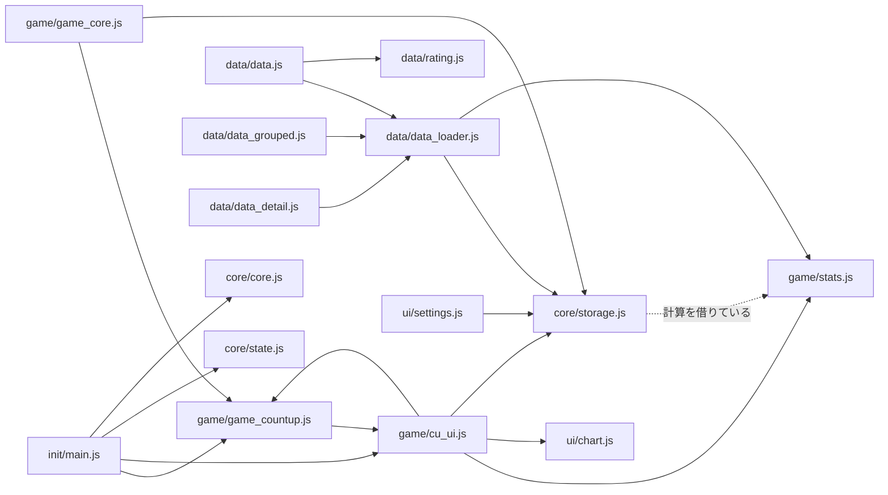

# ダーツアプリ設計書

| 項目 | 内容 |
| --- | --- |
| 作成者 | マチル |
| 初版 | 2026.3.23（LaTeX 版） |
| 最終更新 | 2026.9.30（現行コードに合わせて全面改訂・Markdown 化） |

## 目次

1. [はじめに](#1-はじめに)
2. [目的](#2-目的)
3. [開発環境](#3-開発環境)
4. [画面構成](#4-画面構成)
5. [ディレクトリ構成](#5-ディレクトリ構成)
6. [データ設計](#6-データ設計)
7. [データフロー](#7-データフロー)
8. [モジュール責務定義](#8-モジュール責務定義)
9. [PWA（オフライン対応）](#9-pwaオフライン対応)
10. [現状の課題](#10-現状の課題)
11. [今後の拡張予定](#11-今後の拡張予定)
12. [更新履歴](#12-更新履歴)

---

## 1. はじめに

この文書は、ダーツアプリ開発プロジェクトの設計書である。個人開発のプロジェクトではあるが、各ファイルの責務などを改めて確認するために、簡易的に設計書としてまとめる。

主に JavaScript の責務や関数、CSS の責務などがわからなくならないようにするための資料である。コードを変更した際は、本書も合わせて更新する。

## 2. 目的

本アプリは、ダーツ技術の向上のために、ダーツを家で投げる際の練習を補助し、データを分析することを目的とする。DARTSLIVE などの対戦中心のアプリではなく、練習分析に特化したツールとする。最終的にはアプリケーションとして一般公開を視野に開発する。

現在は、メイン画面・カウントアップ画面・データ表示画面・設定画面・お知らせ画面の 5 画面で構成されている。ゲームの種類はカウントアップのみであるが、今後 01・クリケットをはじめ、ハーフイット・シュートアウトなどのゲームも実装を予定している。

基本的には iPad Pro 11inch の横画面表示での使用を想定しているが、一般公開した場合はスマートフォンで使用するユーザーが多いと考えられる。そのため、各端末での動作テストも行いながら開発する。

## 3. 開発環境

GitHub 上のリポジトリ（`izayoisinya/darts-practice`）を iPad 及びタブレット端末から編集する形式で開発を行う。

| 時期 | 環境 |
| --- | --- |
| 初期 | ChatGPT |
| 〜2026.3 | GitHub Copilot（Web）＋ Spck Editor |
| 〜2026.9 | VS Code ＋ GitHub Copilot |
| 2026.9〜 | Claude Code（Web）。作業ブランチ → PR → `main` へマージ |

- 言語：HTML / CSS / JavaScript（フレームワーク・ビルドツールなし）
- 動作確認：静的サーバー（例：`python3 -m http.server 8000`）で配信してブラウザで開く

### 3.1 端末

**開発及びテストに用いる端末**

| 端末 | 用途 |
| --- | --- |
| iPad Pro 11inch（第 2 世代） | メインの開発端末 |
| iPad Air 11inch（M2 チップ） | 資料の表示、アプリのテスト |
| REDMAGIC Astra | 主にテスト。場合によっては編集作業も行う |

**テストに用いる端末**

| 端末 | 備考 |
| --- | --- |
| Nothing Phone (3) | メインのテスト端末 |
| AQUOS sense 9 | |
| OPPO Reno 11A | |
| Redmi 12 5G | |
| iPhone XR | |
| iPhone 7 | 古い iOS Safari。新しすぎる JS/CSS 機能を避ける目安 |

大枠ができたらメインのテスト端末以外でも確認する。

## 4. 画面構成

画面は以下の 5 つの HTML で構成される。画面の画像は `docs/images/` にあり、サンプルデータを入れた状態で撮影したものである。

| ファイル | 画面 |
| --- | --- |
| `index.html` | メイン画面（メニュー） |
| `countup.html` | カウントアップ画面 |
| `data.html` | データ表示画面（Statistics） |
| `settings.html` | 設定画面 |
| `news.html` | お知らせ画面 |

全画面共通で、画面左端をタップするとサイドメニューが開き、各画面へ遷移できる。

### 4.1 index.html（メイン画面）


アプリを起動してすぐの画面。以下のブロックで構成される。

| ブロック | 内容 |
| --- | --- |
| MAIN GAME | カウントアップ。平均スコア・平均ラウンドスコア・ゲーム数のサマリーを表示 |
| NEXT | 01・Cricket（Coming Soon で押せない） |
| UTILITY | Data・Settings・Info への遷移ボタン |
| 更新情報 / お知らせ | `news.js` の `INFO_CONTENT` の内容を表示 |


### 4.2 countup.html（カウントアップ画面）


カウントアップの画面は、上部のヘッダーと Rounds・Input・Stats の 3 つのエリアで構成される。

| エリア | 内容 |
| --- | --- |
| ヘッダー | 合計スコア、NEXT GAME ボタン（8 ラウンド終了で押せる） |
| Rounds | 各ラウンド（R1〜R8）の 1 投ごとの得点とラウンド合計 |
| Input | ブルモード表示、Bull / In（インナーブル）/ Miss / 戻る、1〜20 と D（ダブル）・T（トリプル）の入力ボタン |
| Stats | PPD・投げた本数・平均ラウンドスコア・最高ラウンドスコア、ブル数とブル率、インナーブル数と率、獲得アワード、ラウンドスコアのグラフ |

**スマートフォン縦向き**


Rounds エリアと Input エリアが横並びになり、その下に Stats エリアが表示される。Rounds エリアをタップするとエリアが開き、各ダーツのスコアが表示される（`body.round-open`）。Input エリアは消さずに幅 0 まで畳む。

**スマートフォン横向き**


各エリアが全て横並びになり、Stats エリアがコンパクト表示になる。コンパクト Stats エリアをタップすると Stats エリアが開き、詳細情報が表示される（`body.iphone-stats-open`）。

**開閉のモーション**

縦・横どちらも `cu_ui.js` の `toggleAreaLayout()` で開閉し、同じ動きにそろえている。

1. 切り替え前に各エリアの位置と大きさを測る
2. `body` のクラスを切り替え、切り替え後の位置と大きさを測る
3. Web Animations（`element.animate()`）で、前の位置・大きさから新しい位置・大きさへ 0.3 秒かけて動かす（畳まれるエリアはフェードアウト）
4. 切り替え中は `body.area-animating` が付き、新しく出る中身（各投のスコア・Stats の詳細／コンパクト表示）が少し遅れてふわっと表示される（`phone.css` の `areaContentIn`）
5. 動き終わってから Stats のグラフを描き直す

`element.animate()` が使えないブラウザや、端末で「視差効果を減らす」が有効な場合はアニメーションせずに切り替える。CSS 側でエリアの幅に transition を付けると測定がずれるため付けないこと。

### 4.3 data.html（データ表示画面）


保存されたスコア記録データを表示する画面。現段階ではカウントアップのデータのみを扱う。画面下部のタブで表示形式を切り替える。

| ビュー | 左（History） | 右（Stats） |
| --- | --- | --- |
| Game | 1 ゲームずつのカード（スコア・PPD・ラウンド平均・ブル・トリプル数・ラウンドスコアのグラフ・アワード） | 全体の Stats・Awards、直近 30 ゲームのスコア推移、期間 A/B の比較グラフ、レーティング目安 |
| Day / Week / Month / Year | 期間ごとのまとめ（平均スコア・平均 PPD・ブル数）、メモボタン | カレンダー（練習した日に印）、タグ集計 |


- Day のカードを選ぶと、その日のゲーム一覧（詳細ビュー）を表示する。詳細ビューではその日のブル率や、他の日との比較グラフを表示できる
- **Memo**：日ごとにコメント・タグ・セッティング画像を保存できる。タグは絞り込みや比較に使う
- スマートフォン縦向きでは、上部の History / Stats の切り替え（左右スワイプ対応）でパネルを切り替える


### 4.4 settings.html（設定画面）


| 区分 | 項目 | 内容 |
| --- | --- | --- |
| GAME | Bull Mode | FAT（アウター 50 / インナー 50、値 `fat`）と SEPARATE（アウター 25 / インナー 50、値 `double`）の切り替え。変更すると進行中のゲームはリセットされる |
| GAME | Rounds | 8 / 10 / 15 を選べるが保存されず、ゲームは 8 ラウンド固定。01・クリケット実装時に調整予定 |
| DISPLAY | Screen Orientation | 画面の向きの固定（Free / Portrait Lock / Landscape Lock）。ブラウザによっては効かない |
| データ保存状況 | — | 保存ゲーム数、保存先（IndexedDB / LocalStorage）、使用容量・上限の概算 |

### 4.5 news.html（お知らせ画面）

「すべて / 更新情報 / お知らせ / 更新予定」のタブで切り替えて表示する。内容は `js/ui/news.js` の `INFO_CONTENT` に直接書かれており、メイン画面のブロックと共通である。

## 5. ディレクトリ構成

```
darts-practice/
├── index.html / countup.html / data.html / settings.html / news.html
├── manifest.json        PWA マニフェスト
├── sw.js                Service Worker
├── icon-192.png / icon-512.png
├── css/
│   ├── base.css / theme.css / menu.css / news.css
│   ├── layout/          lay_*.css
│   └── responsive/      phone.css / tablet.css / desktop.css
├── js/
│   ├── core/            state.js / core.js / storage.js
│   ├── init/            main.js
│   ├── game/            game_core.js / game_countup.js / cu_ui.js / stats.js
│   ├── data/            data_loader.js / data.js / data_grouped.js / data_detail.js / rating.js
│   └── ui/              chart.js / settings.js / news.js
└── docs/                本設計書と画面画像
```

### 5.1 CSS

| 区分 | ファイル | 内容 |
| --- | --- | --- |
| ベース | `base.css` | 全体のベースとなる設定 |
| ベース | `theme.css` | 色などのデザイン（CSS 変数 `--accent` など） |
| レイアウト | `layout/lay_core.css` | ゲーム画面のレイアウトの基礎 |
| レイアウト | `layout/lay_header.css` | ゲーム画面のヘッダー |
| レイアウト | `layout/lay_round.css` | ゲーム画面の Rounds エリア |
| レイアウト | `layout/lay_input.css` | ゲーム画面の Input エリア |
| レイアウト | `layout/lay_stats.css` | ゲーム画面の Stats エリア |
| レイアウト | `layout/lay_menu.css` | サイドメニュー |
| レイアウト | `layout/lay_data.css` | データ表示画面 |
| レスポンシブ | `responsive/phone.css` | スマートフォンのレイアウト |
| レスポンシブ | `responsive/tablet.css` | タブレットのレイアウト |
| レスポンシブ | `responsive/desktop.css` | デスクトップのレイアウト |
| 画面別 | `menu.css` | メイン画面 |
| 画面別 | `news.css` | お知らせ画面・メイン画面のお知らせブロック |

端末の切り替えはメディアクエリではなく、`core.js` の `detectDevice()` が `body` に付けるクラスで行う。

| クラス | 条件 |
| --- | --- |
| `phone` | iPhone、または幅 1500px 未満の Android |
| `tablet` | iPad、幅 1500px 以上の Android、またはその他で幅 1600px 未満 |
| `desktop` | 上記以外 |
| `portrait` / `landscape` | 高さ > 幅なら `portrait` |

### 5.2 JavaScript

ES Modules は使わず、各 HTML が `<script defer>` で順に読み込む。関数・変数はすべてグローバルである。読み込み順は `core/`（state → core → storage）→ 画面ごとの JS → 最後に `init/main.js` とする。

| 画面 | 読み込む JS（core / main 以外） |
| --- | --- |
| index.html | ui/news.js |
| countup.html | game/*（stats → game_core → game_countup → cu_ui）、data/*（rating 以外）、ui/chart.js、ui/settings.js |
| data.html | game/stats.js（アワード判定）、data/*（data_loader → data_grouped → data_detail → rating → data） |
| settings.html | game/*、ui/settings.js |
| news.html | ui/news.js |

#### core/state.js

グローバル変数・定数を定義する。関数は含まないものとする。

| 名前 | 内容 |
| --- | --- |
| `TOTAL_ROUNDS` | ラウンド数（8） |
| `MAX_SCORE` | 1 ラウンドの最大スコア（180） |
| `bullMode` | ブルモード（`"fat"` / `"double"`） |
| `lockedRound` | Undo で戻れない確定済みラウンド |
| `game` | ゲーム状態 `{ rounds, currentRound, currentDart }` |

#### core/core.js

全画面共通の関数。

| 関数 | 内容 |
| --- | --- |
| `detectDevice()` | 端末種別と向きを判定し、`body` にクラスを付ける |
| `refreshLayout()` | 画面回転やリサイズ時にレイアウトを再設定する |
| `setupLinks()` | 画面間ナビゲーションをセットアップする |

#### core/storage.js

データの保存と読み込み。ビジネスロジックは含まないものとする。

| 関数 | 内容 |
| --- | --- |
| `initSessionsStorage()` | 保存先（IndexedDB / LocalStorage）を決め、履歴をメモリに読み込む。旧形式からの移行も行う |
| `readSessions()` / `writeSessions()` | ゲーム履歴の読み込み・保存（書き込みはキューで順番に実行） |
| `clearSessionsStorage()` | ゲーム履歴を全削除する |
| `getSessionsStorageBackend()` | 現在の保存先を返す |
| `saveGame()` / `loadGame()` | 進行中のゲーム状態の保存・読み込み |
| `saveSession()` | 終了したゲームを履歴に追加する |
| `normalizeSessionForApp()` | 履歴 1 件をアプリ内の形式に整える（欠損値の補完） |
| `serializeSessionForStorage()` / `deserializeSessionFromStorage()` | 保存用の短縮形式との相互変換 |

#### init/main.js

初期化処理とイベント登録の統括。

| 関数 | 内容 |
| --- | --- |
| `initApp()` | アプリの初期化（SW 登録、保存領域の準備、端末判定、ゲーム初期化など） |
| `registerEvents()` | サイドメニュー、NEXT GAME、スマホでのエリア開閉などのイベントを登録する |
| `registerServiceWorker()` | Service Worker を登録する |
| `applyOrientationPreference()` | 設定に従って画面の向きを固定・解除する |
| `initMenuSummary()` | メイン画面のサマリー（平均スコアなど）を表示する |

#### game/game_core.js

ゲーム画面共通のロジック。UI 生成に関わる関数は含まないものとする。

| 関数 | 内容 |
| --- | --- |
| `updateNextGameButton()` | NEXT GAME ボタンの有効・無効を更新する |
| `nextGame()` | 履歴を保存して次のゲームを始める |
| `undoDart()` | 最後のダーツの入力を取り消す（確定済みラウンドには戻れない） |
| `isGameComplete()` | 全ラウンド入力済みかを判定する |
| `forceResetGame()` | 進行中ゲームと全履歴を削除する（確認ダイアログあり） |

#### game/game_countup.js

カウントアップ固有のロジック。UI 生成に関わる関数は含まないものとする。

| 関数 | 内容 |
| --- | --- |
| `initGame(load)` | 設定を読み込み、ゲームを初期化する（`load` が true なら途中のゲームを復元） |
| `addDart(value, multiplier, special)` | 1 投を記録し、3 投で次のラウンドへ進める |

#### game/cu_ui.js

カウントアップの UI 生成と DOM 操作。

| 関数 | 内容 |
| --- | --- |
| `updateUI()` | 画面全体を更新し、ゲーム状態を保存する |
| `renderDart()` | 1 投分の表示を作る（ブル・ダブル・トリプル・ミスで色分け） |
| `renderRounds()` | ラウンド一覧を表示する |
| `createNumberTable()` / `createNumberRow()` | 1〜20 と D / T の入力ボタンを生成する |
| `setupTopButtons()` | Bull / In / Miss / 戻る ボタンをセットアップする |
| `updateBullModeUI()` | ブルモードの表示を更新する |
| `toggleAreaLayout(className, onDone)` | Rounds / Stats の開閉（`body` のクラス切り替え）を、各エリアが伸び縮みするアニメーション付きで行う |

#### game/stats.js

スタッツ・アワードの計算。

| 関数 | 内容 |
| --- | --- |
| `judgeRoundAward(round)` | 1 ラウンドのアワードを判定する（1 ラウンド 1 つ、上位のみ） |
| `countRoundAwards(rounds)` | 全ラウンドのアワード数を数える。データ表示画面の再計算もこれを使う |
| `calculateStats()` | 現在のゲームから合計・PPD・ブル率・最高ラウンド・アワード数などを計算する |
| `updateStats()` | 計算結果を Stats エリアに表示する |
| `showAward()` | アワードの表示・非表示を切り替える |

アワードの判定条件（3 投完了したラウンドのみ）。**1 ラウンドにつき 1 つだけ**とし、複数に当てはまる場合は上の行（優先順位が高いもの）を採用する。

| 優先 | アワード | 条件 |
| --- | --- | --- |
| 1 | Ton 80 | 180 点 |
| 2 | 3 in the Black | 3 投すべてインナーブル |
| 3 | Hat Trick | 3 投すべてブル |
| 4 | 3 in the Bed | 同じ数字のトリプル（T15〜T20）に 3 本 |
| 5 | White Horse | 異なる数字のトリプル（T15〜T20）に 3 本 |
| 6 | High Ton | 151 点以上 |
| 7 | Low Ton | 100 点以上 |

例：インナーブル × 3 は 3 in the Black のみ（Hat Trick には数えない）、T20 × 3 は Ton 80 のみ、T20・T19・T18 は White Horse のみ。

#### data/data_loader.js

履歴の読み込み・加工と、Game ビューの一覧表示。

| 関数 | 内容 |
| --- | --- |
| `initDataPage()` | データ表示画面を初期化する |
| `loadSessions()` | Game ビューの履歴カードを表示する |
| `createSessionCardHtml()` | 1 ゲーム分のカードを生成する |
| `createRoundChartHtml()` | カード内のラウンドスコアのグラフを生成する |
| `getSessionAwards()` | 履歴のアワード数を返す（保存値がなければ `countRoundAwards()` で再計算） |
| `groupSessions(sessions, mode)` | 履歴を日・週（月曜始まり）・月・年ごとにまとめる |
| `calcSummary()` | まとめた履歴の集計値を計算する |
| `getLocalDateKey()` / `getWeekRange()` / `formatShort()` | 日付の変換・整形 |
| `renderPagination()` / `changePage()` / `updatePaginationUI()` | ページ送り（1 ページ 10 件） |

#### data/data.js

データ表示画面の統括。

| 関数 | 内容 |
| --- | --- |
| `changeView(mode)` | Game / Day / Week / Month / Year を切り替える |
| `renderView()` | 現在のビューを描画する |
| `setDataPanel()` / `setupDataPanelSwipe()` | スマホ縦での History / Stats パネル切り替え |
| `loadStats()` / `addStat()` | 全体の Stats・Awards を表示する |
| `drawGameScoresChart()` | 直近 30 ゲームのスコア推移グラフを描く |
| `drawSelectedRangeChart()` | 期間 A / B の比較グラフを描く |
| `drawDetailGroupChart()` | 詳細ビューのグラフ（比較日との重ね表示）を描く |
| `renderDetailBullRate()` | 詳細ビューのブル率を表示する |
| `renderRatingReference()` | レーティング目安を表示する |

#### data/data_grouped.js

グループビュー（Day / Week / Month / Year）と日別メモ。

| 関数 | 内容 |
| --- | --- |
| `displayGroupView()` / `renderGroupedPaginated()` / `displayGroupedPage()` | グループごとのカードをページ単位で表示する |
| `renderGroupedPagination()` / `changeGroupedPage()` | グループビューのページ送り |
| `updateGroupedLeftCalendar()` | カレンダーを表示する |
| `jumpToCalendarDay()` | カレンダーの日付から詳細ビューへ移動する |
| `getDayNote()` / `setDayNote()` | 日別メモの読み書き |
| `toggleDayTagFilter()` / `getFilteredGroupedEntries()` | タグで絞り込む |

#### data/data_detail.js

詳細ビュー（グループ内のゲーム一覧）。

| 関数 | 内容 |
| --- | --- |
| `showGameDetails()` / `displayDetailPage()` | 指定した日のゲーム一覧を新しい順に表示する（番号はその日の何ゲーム目か） |
| `changeDetailPage()` / `updateDetailPaginationUI()` | 詳細ビューのページ送り |
| `backToSummary()` | グループビューに戻る（ブラウザの戻るにも対応） |
| `setupDetailCompareControls()` | 比較する日を選ぶ |
| `drawGroupCalendar()` / `renderMonthCalendar()` / `renderYearCalendar()` | 詳細ビューのカレンダー |

#### data/rating.js

| 関数 | 内容 |
| --- | --- |
| `calcDartsLiveRT(ppd)` | PPD から DARTSLIVE のレーティング目安を求める |
| `calcPhoenixRating(ppd)` | PPD から PHOENIX のレーティング目安を求める |
| `calculateRatings(sessions, window)` | 直近のゲーム（既定 20 件）からレーティング目安を求める |

#### ui/chart.js

| 関数 | 内容 |
| --- | --- |
| `drawScoreChart()` | カウントアップ画面のラウンドスコアのグラフを描く。計算は行わず描画のみ |

#### ui/settings.js

| 関数 | 内容 |
| --- | --- |
| `initSettingsPage()` | 設定画面を初期化する |
| `readSettings()` / `writeSettings()` | 設定の読み書き（既定値あり） |
| `loadSettings()` / `saveSettings()` | 画面と設定を同期する |
| `applyOrientationMode()` | 画面の向きの設定を反映する |
| `updateStorageStatus()` | データ保存状況を表示する |

#### ui/news.js

| 関数 | 内容 |
| --- | --- |
| `initNewsPage()` / `initMainInfoSections()` | お知らせ画面・メイン画面のお知らせを表示する |
| `switchInfoTab()` | お知らせのタブを切り替える |

## 6. データ設計

データはすべて端末のブラウザ内に保存し、外部には送信しない。

### 6.1 保存先

| キー | 保存先 | 内容 |
| --- | --- | --- |
| `dartsPracticeDB` / store `app` / key `sessions` | IndexedDB | ゲーム履歴。IndexedDB が使えない場合は LocalStorage の `dartsSessionsV2` に保存 |
| `dartsSessions` | LocalStorage | 旧形式のゲーム履歴（読み込み時に新形式へ移行） |
| `dartsPractice` | LocalStorage | 進行中のゲーム |
| `dartsSettings` | LocalStorage | 設定 |
| `dartsDayNotesV2` | LocalStorage | 日別メモ |

### 6.2 ゲーム履歴（1 件）

アプリ内では以下の形で扱い、保存時は容量節約のため短縮キーに変換する。

| アプリ内 | 保存時 | 内容 |
| --- | --- | --- |
| `date` | `d` | 終了日時（ミリ秒） |
| `score` | `s` | 合計スコア |
| `ppd` | `p` | 1 投あたりの平均点 |
| `bulls` | `b` | ブル数（アウター＋インナー） |
| `innerBulls` | `i` | インナーブル数 |
| `bullRate` | `br` | ブル率（%） |
| `innerRate` | `ir` | インナーブル率（%） |
| `roundAvg` | `ra` | 平均ラウンドスコア |
| `tripleHits` | `t` | T15〜T20 の本数（保存時は配列） |
| `awards` | `a` | アワードごとの回数（保存時は配列） |
| `totalAwards` | `ta` | アワード合計数 |
| `roundScores` | `r` | 各ラウンドのスコア |
| `gameType` | `g` | ゲームの種類（現在は `"countup"` のみ） |

項目を追加するときは、変換の 3 関数（normalize / serialize / deserialize）をそろえて変更し、欠損時の既定値を用意して既存の保存データを壊さないようにする。

### 6.3 進行中のゲーム

```js
{
  gameType: "countup",
  rounds: [                 // 8 ラウンド × 3 投。未入力は null
    [{ value, multiplier, score, special }, …],
    …
  ],
  currentRound, currentDart, lockedRound
}
```

`special` はブルの場合に `"outerBull"` / `"innerBull"` が入る。

### 6.4 設定

```js
{ bullMode: "fat" | "double", orientationMode: "auto" | "portrait" | "landscape" }
```

### 6.5 日別メモ

```js
{
  "2026-09-29": { comment, tags: [ … ], imageData /* 画像の Data URL */, updatedAt }
}
```

## 7. データフロー

### 7.1 ゲーム画面の処理フロー

1. `main.js` の `initApp()` が実行され、保存領域を準備し、端末を判定する
2. `cu_ui.js` の `setupTopButtons()` と、`game_countup.js` の `initGame()` から呼ばれる `createNumberTable()` で入力ボタンを生成する
3. `main.js` の `registerEvents()` でイベントを登録する
4. ユーザーが入力ボタンを押す
5. `game_countup.js` の `addDart()` で 1 投を記録する
6. `cu_ui.js` の `updateUI()` が画面を更新する（`stats.js` で計算 → 表示、`chart.js` でグラフ描画）
7. `storage.js` の `saveGame()` で進行中のゲームを保存する
8. 8 ラウンド終了後に NEXT GAME を押すと、`game_core.js` の `nextGame()` → `storage.js` の `saveSession()` で履歴に追加し、次のゲームを始める

### 7.2 データ表示画面の処理フロー

1. `data_loader.js` の `initDataPage()` が実行される
2. `storage.js` の `initSessionsStorage()` → `readSessions()` で履歴を取得する
3. Game ビュー：`loadSessions()` でカード表示、`data.js` で全体の Stats・グラフを描画する
4. Day / Week / Month / Year ビュー：`groupSessions()` でまとめ、`data_grouped.js` でページ単位に表示する
5. カードやカレンダーを選ぶと、`data_detail.js` の詳細ビューへ移動する

## 8. モジュール責務定義

### 8.1 責務分離の原則

- ビジネスロジック（ゲーム処理）と UI 操作を分離する
- データの永続化（`storage.js`）は他のロジックに依存しない
- 統計計算（`stats.js`）は再利用可能にする
- 各モジュールは単一の責務を持つ

### 8.2 モジュール依存関係



## 9. PWA（オフライン対応）

- `manifest.json` によりホーム画面に追加でき、全画面（standalone）で起動する
- `sw.js` は、HTML はネットワーク優先、それ以外（JS・CSS・画像）はキャッシュ優先で配信する
- **JS / CSS を変更したら `sw.js` のキャッシュ名（`darts-app-vN` / `darts-runtime-vN`）の番号を上げる。** 上げないと、利用者の端末に古いファイルが残り続ける
- 新しいファイルを追加したら `PRECACHE_URLS` にも追加する

## 10. 現状の課題

設計原則と実装が食い違っている箇所や、気になる点をまとめる。直したら本節から消す。

| 箇所 | 内容 |
| --- | --- |
| `storage.js` の `saveSession()` | 履歴の値を `stats.js` の `calculateStats()` で計算しており、「永続化は他に依存しない」原則から外れている |
| `stats.js` の `updateStats()` / `showAward()` | 画面への表示（DOM 操作）を行っており、「stats は計算のみ」の原則から外れている |
| `data.html` | `initDataPage()` が `<body onload>` と `DOMContentLoaded` の両方から呼ばれ、2 回実行されている |
| 設定画面の Rounds | 8 / 10 / 15 の選択肢はあるが保存されず、ゲームにも反映されない（8 固定） |
| `countup.html` | データ表示画面用の JS（data_loader.js / data.js など）も読み込んでおり、その初期化処理が要素がないためエラーになっている（動作には影響なし） |
| スマホ横向きのカウントアップ画面 | ラウンド合計の数字が右端で切れて見える場合がある（iPhone 13 相当の画面で確認） |

## 11. 今後の拡張予定

**ゲーム追加**

- 01（ダーツの基本ゲーム）
- クリケット
- ハーフイット
- シュートアウト

**機能追加**

- 高度な分析機能（ブル練習分析・スタッツ分析など）
- ユーザーアカウント機能
- オンライン対戦
- AI との対戦

## 12. 更新履歴

| 日付 | 内容 |
| --- | --- |
| 2026.3.23 | 初版（LaTeX） |
| 2026.9.30 | 現行コードに合わせて全面改訂し、Markdown 化。画面画像を撮り直し、データ設計・PWA・現状の課題の章を追加 |
| 2026.9.30 | アワード判定を `stats.js` に一本化。1 ラウンド 1 アワード（優先順位あり）に変更し、3 in the Bed / White Horse で T15 が判定されない不具合を修正 |
| 2026.9.30 | 日別詳細画面のゲーム番号のずれを修正し、新しいゲームから表示するよう変更 |
| 2026.9.30 | カウントアップ画面の Rounds / Stats の開閉モーションを、端末・向きに関係なく同じ伸び縮みの動きにそろえた |
